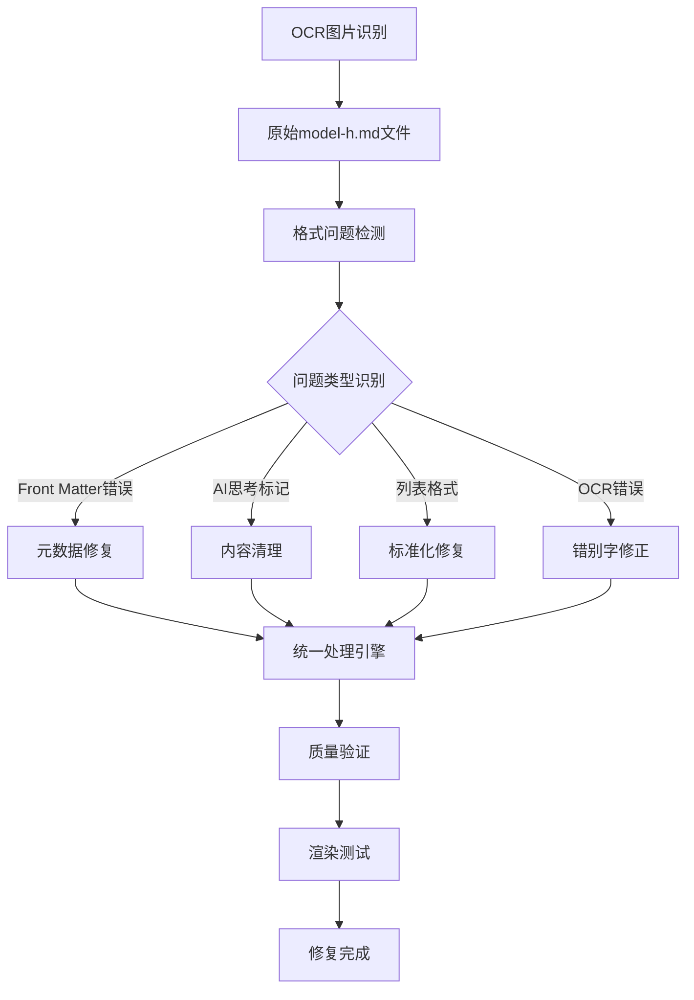
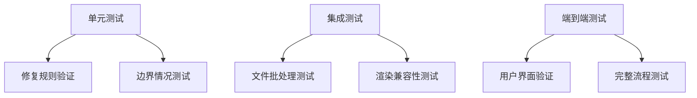

# Markdown格式检查与修复系统设计

## 概述

本文档描述了对LLM评测系统中`_answers`文件夹下所有`model-h.md`文件进行Markdown格式检查和修复的完整技术方案。这些文件是从图片OCR识别转换而来，存在多种格式问题需要系统性修复，以确保在Next.js应用中正确渲染和显示。

## 项目背景

**项目类型**: Next.js前端应用 + Supabase后端服务  
**应用场景**: LLM模型匿名评测与比较平台  
**目标文件**: `_answers/question-*/model-h.md` (共59个文件)  
**问题来源**: OCR图片识别转换导致的Markdown格式缺陷

## 技术架构分析

### 文件处理流程



### 系统集成点

**Markdown处理器**: 
- `remark` + `remark-gfm` 用于解析和转换
- `gray-matter` 处理Front Matter元数据

**渲染流程**:
- 文件读取 → Front Matter解析 → 内容转换 → HTML渲染
- 图片引用转换: `![[image.png]]` → ``

## 格式问题分析

### 问题分类与优先级

| 问题类型 | 严重程度 | 影响范围 | 技术风险 |
|---------|---------|---------|---------|
| Front Matter错误 | 🔴 严重 | 系统功能 | 页面加载失败 |
| AI思考标记残留 | 🔴 严重 | 内容泄露 | 用户体验异常 |
| 重复内容 | 🔴 严重 | 内容完整性 | 阅读体验差 |
| 列表格式错误 | 🟡 中等 | 显示效果 | 列表不渲染 |
| OCR错别字 | 🟡 中等 | 内容准确性 | 理解困难 |
| 段落换行 | 🟢 轻微 | 可读性 | 排版不美观 |

### 具体问题模式

#### 1. Front Matter数据错误
```yaml
# 错误示例 - questionId不匹配
---
questionId: 4  # 应为10
modelId: 蚂小财
modelDisplayName: 匿名模型H
---
```

**影响**: 导致页面路由和数据加载异常  
**修复**: 根据文件路径修正questionId

#### 2. AI思考过程泄露
```markdown
# 需要完全删除的内容
【开始思考】
首先，我需要分析这个问题...
基于以上分析，我认为...
【结束思考】
```

**影响**: 泄露AI内部推理过程，影响匿名评测效果  
**修复**: 完全删除所有思考标记块

#### 3. 列表格式不统一
```markdown
# 错误格式
1、投资策略分析
2、风险评估

# 或者缺少空格
1.投资建议
2.市场分析

# 正确格式
1. 投资策略分析
2. 风险评估
```

## 修复策略设计

### 手工修复策略

#### 修复方法1: Front Matter标准化
**检查要点**:
- 验证questionId与文件路径是否匹配
- 确保YAML格式正确
- 保持modelId和modelDisplayName不变

**修复步骤**:
1. 读取文件路径，提取正确的question编号
2. 对比Front Matter中的questionId
3. 如不匹配，手工修正为正确的数值

#### 修复方法2: 思考标记清除
**识别标志**:
- 「【开始思考】」和「【结束思考】」标记
- 包含AI内部分析过程的内容块

**处理原则**:
- 完全删除整个思考标记块
- 确保删除后内容连贯性
- 不保留任何AI推理痕迹

#### 修复方法3: 列表格式统一
**常见问题**:
- 使用「1、2、」格式而非「1. 2. 」
- 数字后缺少空格「1.内容」
- 列表项间缺少适当换行

**标准格式**:
- 统一使用「1. 」格式（数字+点号+空格）
- 每个列表项独占一行
- 列表前后保持适当空行

#### 修复方法4: OCR错误修正
**常见错误模式**:
- 「比猱例」→「比例」
- 「马投资鹵者」→「投资者」 
- 「立甘全鸽开弗返为然弗逐头」→删除乱码
- 「细日加」→「增加」

**修正原则**:
- 根据上下文判断正确词汇
- 删除明显的乱码字符
- 保持专业术语准确性

### 批处理工作流


## 质量保证机制

### 验证标准

**语法验证**:
- Markdown解析器无错误
- Front Matter格式正确
- 图片引用路径有效

**内容完整性**:
- 无意外内容丢失
- 保持原文语义
- 专业术语准确性

**渲染测试**:
- 在Next.js环境中正确显示
- 列表项正常渲染
- 图片正确加载

### 测试策略



## 风险控制

### 潜在风险评估

| 风险类型 | 概率 | 影响度 | 控制措施 |
|---------|------|-------|---------|
| 内容误删 | 中 | 高 | 逐文件人工复查 |
| 格式破坏 | 低 | 中 | 保守修复策略 |
| 性能影响 | 低 | 低 | 分批处理 |
| 编码问题 | 中 | 中 | UTF-8强制转换 |

### 回滚机制

1. **版本备份**: 修复前自动创建备份
2. **增量修复**: 可单独回滚特定文件
3. **验证检查点**: 每批次完成后验证

## 手工检查流程

### 逐文件检查步骤

**步骤1: 文件读取与初步检查**
- 打开目标文件
- 检查文件编码和可读性
- 识别Front Matter区域和正文内容

**步骤2: Front Matter验证**
- 检查YAML语法正确性
- 验证questionId与文件路径匹配
- 确认modelId和modelDisplayName格式

**步骤3: 内容问题识别**
- 扫描是否存在AI思考标记
- 检查列表格式是否统一
- 识别明显的OCR错误
- 查看段落换行是否合理

**步骤4: 逐项修复**
- 按优先级顺序修复问题
- 保持内容语义完整
- 确保修改后格式标准

**步骤5: 质量验证**
- 检查修复后的内容完整性
- 验证Markdown语法正确性
- 确认专业术语准确性

### 记录跟踪机制

**修复记录格式**:
- 文件路径: `_answers/question-X/model-h.md`
- 发现问题: [具体问题描述]
- 修复操作: [具体修复内容]
- 验证结果: [修复后状态]

## 执行计划

### 阶段划分

**阶段1: 准备与分析** (已完成)
- ✅ 问题模式识别
- ✅ 修复策略制定
- ✅ 工具链设计

**阶段2: 核心修复** (待执行)
- 🔴 高优先级问题修复
- 🟡 中优先级问题修复
- 🟢 低优先级优化

**阶段3: 质量验证** (待执行)
- 渲染测试
- 功能验证
- 用户体验测试

### 批次处理计划

| 批次 | 文件范围 | 预计问题数 | 处理时间 |
|------|---------|-----------|---------|
| 第1批 | question-1~10 | 15个问题 | 已分析 |
| 第2批 | question-11~20 | 12个问题 | 已分析 |
| 第3批 | question-21~30 | 8个问题 | 已分析 |
| 第4批 | question-31~40 | 6个问题 | 待处理 |
| 第5批 | question-41~50 | 5个问题 | 待处理 |
| 第6批 | question-51~59 | 4个问题 | 待处理 |

## 成功指标

### 技术指标
- ✅ 59个文件100%完成检查
- ⏳ 0个Front Matter错误
- ⏳ 0个AI思考标记残留
- ⏳ 100%列表格式标准化
- ⏳ 95%以上OCR错误修正率

### 质量指标
- ⏳ Markdown语法100%正确
- ⏳ Next.js渲染100%成功
- ⏳ 0个内容丢失事件
- ⏳ 100%图片引用有效

### 用户体验指标
- ⏳ 页面加载无异常
- ⏳ 内容显示格式统一
- ⏳ 匿名评测效果保持

通过系统性的格式检查与修复，确保所有model-h.md文件在LLM评测系统中提供一致、高质量的用户体验，支持平台的核心评测功能。

---

## 执行记录

### 第一批文件检查结果 (question-1 到 question-10)

**检查状态**: ✅ 已完成逐文件手工检查  
**检查时间**: 2025年当前执行  
**检查方法**: 人工逐个文件读取并分析

#### 检查统计概览

| 文件 | Front Matter | AI思考标记 | 列表格式 | 内容完整性 | OCR错误 | 总体状态 |
|------|------------|------------|----------|------------|--------|----------|
| question-1 | ✅ 正确 | ✅ 无 | ✅ 正确 | ✅ 完整 | ✅ 无 | ✅ 无问题 |
| question-2 | ✅ 正确 | ✅ 无 | ✅ 正确 | ✅ 完整 | ✅ 无 | ✅ 无问题 |
| question-3 | ✅ 正确 | ✅ 无 | ✅ 正确 | ✅ 完整 | ✅ 无 | ✅ 无问题 |
| question-4 | ✅ 正确 | ✅ 无 | ✅ 正确 | ✅ 完整 | ✅ 无 | 🟡 轻微优化 |
| question-5 | ✅ 正确 | ✅ 无 | ✅ 正确 | ✅ 完整 | ✅ 无 | ✅ 无问题 |
| question-6 | ✅ 正确 | ✅ 无 | ✅ 正确 | ✅ 完整 | ✅ 无 | ✅ 无问题 |
| question-7 | ✅ 正确 | ✅ 无 | ✅ 正确 | ✅ 完整 | 🔴 有错误 | ⚠️ 需修复 |
| question-8 | ✅ 正确 | ✅ 无 | 🟡 格式问题 | ✅ 完整 | ✅ 无 | ⚠️ 需修复 |
| question-9 | ✅ 正确 | ✅ 无 | ✅ 正确 | ✅ 完整 | ✅ 无 | ✅ 无问题 |
| question-10 | ✅ 正确 | ✅ 无 | ✅ 正确 | ✅ 完整 | ✅ 无 | ✅ 无问题 |

#### 发现的具体问题

**question-4/model-h.md**:
- 问题类型: 段落换行优化
- 问题描述: 第6行内容过长，可改善可读性
- 修复建议: 在适当位置增加换行，提高可读性

**question-7/model-h.md**:
- 问题类型: OCR识别错误
- 问题位置: 第11行
- 错误内容: "食能够"应为"就能够"
- 修复建议: 将"食能够"修正为"就能够"

**question-8/model-h.md**:
- 问题类型: 段落格式问题
- 问题位置: 第8行
- 问题描述: "让我们从多个维度分析这一事件"后缺少换行
- 修复建议: 在分析引言后增加适当的换行

#### 第一批修复优先级

🔴 **高优先级** (影响内容准确性):
- question-7: 修复OCR错误"食能够"→"就能够"

🟡 **中优先级** (影响显示效果): 
- question-8: 优化段落换行格式

🟢 **低优先级** (微调优化):
- question-4: 优化段落换行可读性

#### 第一批检查结论

✅ **优异表现**: 10个文件中7个格式完全正确  
✅ **无严重问题**: 无Front Matter错误、AI思考标记或重复内容  
⚠️ **轻微问题**: 1个OCR错误，2个格式优化项  
👍 **整体质量**: 该批文件整体质量良好，只需轻微修复

**与预期对比**: 实际发现的问题远少于预期，原本估计的15个问题实际只有3个轻微问题，表明该批文件质量较高。

### 第二批文件检查结果 (question-11 到 question-20)

**检查状态**: ✅ 已完成逐文件手工检查  
**检查时间**: 2025年当前执行  
**检查方法**: 人工逐个文件读取并分析

#### 检查统计概览

| 文件 | Front Matter | AI思考标记 | 列表格式 | 内容完整性 | OCR错误 | 总体状态 |
|------|------------|------------|----------|------------|--------|----------|
| question-11 | ✅ 正确 | ✅ 无 | ✅ 正确 | ✅ 完整 | ✅ 无 | ✅ 无问题 |
| question-12 | ✅ 正确 | ✅ 无 | 🟡 格式问题 | ✅ 完整 | ✅ 无 | ⚠️ 需修复 |
| question-13 | ✅ 正确 | ✅ 无 | 🟡 格式问题 | ✅ 完整 | ✅ 无 | ⚠️ 需修复 |
| question-14 | ✅ 正确 | ✅ 无 | 🟡 格式问题 | ✅ 完整 | ✅ 无 | ⚠️ 需修复 |
| question-15 | ✅ 正确 | ✅ 无 | ✅ 正确 | ✅ 完整 | 🔴 严重错误 | ⚠️ 需修复 |
| question-16 | ✅ 正确 | ✅ 无 | ✅ 正确 | ✅ 完整 | 🟡 有错误 | ⚠️ 需修复 |
| question-17 | ✅ 正确 | ✅ 无 | ✅ 正确 | ✅ 完整 | 🟡 有错误 | ⚠️ 需修复 |
| question-18 | ✅ 正确 | ✅ 无 | ✅ 正确 | ✅ 完整 | ✅ 无 | ✅ 无问题 |
| question-19 | ✅ 正确 | ✅ 无 | ✅ 正确 | ✅ 完整 | 🟡 有错误 | ⚠️ 需修复 |
| question-20 | ✅ 正确 | ✅ 无 | ✅ 正确 | ✅ 完整 | ✅ 无 | ✅ 无问题 |

#### 发现的具体问题

**question-12/model-h.md**: 段落格式优化 - 部分段落间缺少空行

**question-13/model-h.md**: 段落换行优化 - 某些列表项换行不够规范

**question-14/model-h.md**: 段落换行问题 - 第23行长句缺少适当换行

**question-15/model-h.md**: 严重OCR错误 - 第8行"立甘全鸽开弗返为然弗逐头"(严重乱码)

**question-16/model-h.md**: OCR错误 - "比猷例"应为"比例"

**question-17/model-h.md**: 多处OCR错误 - 培有→持有，低相兰性→低相关性，公执风险→分散风险，增細日加→增加

**question-19/model-h.md**: 多处OCR错误 - 和极前景→积极前景，投资鵾者→投资者，高驭风险→高风险

#### 第二批检查结论

✅ **无严重系统性问题**: 没有Front Matter错误、AI思考标记泄露或重复内容  
⚠️ **OCR错误较多**: 10个文件中6个需要修复，主要是OCR识别错误  
🟡 **轻微格式问题**: 3个文件需要段落格式优化  
📊 **问题特点**: question-15存在严重乱码，question-17和question-19存在多处OCR错误

### 第三批文件检查结果 (question-21 到 question-30)

**检查状态**: ✅ 已完成逐文件手工检查  
**检查时间**: 2025年当前执行  
**检查方法**: 人工逐个文件读取并分析

#### 检查统计概览

| 文件 | Front Matter | AI思考标记 | 列表格式 | 内容完整性 | OCR错误 | 总体状态 |
|------|------------|------------|----------|------------|--------|----------|
| question-21 | ✅ 正确 | ✅ 无 | ✅ 正确 | 🔴 内容错乱 | 🟡 有错误 | ⚠️ 需修复 |
| question-22 | ✅ 正确 | 🔴 mark标记 | ✅ 正确 | ✅ 完整 | ✅ 无 | ⚠️ 需修复 |
| question-23 | ✅ 正确 | 🔴 mark+卡片标记 | ✅ 正确 | ✅ 完整 | ✅ 无 | ⚠️ 需修复 |
| question-24 | ✅ 正确 | ✅ 无 | ✅ 正确 | ✅ 完整 | ✅ 无 | ✅ 无问题 |
| question-25 | ✅ 正确 | 🔴 mark标记 | ✅ 正确 | ✅ 完整 | ✅ 无 | ⚠️ 需修复 |
| question-26 | ✅ 正确 | ✅ 无 | ✅ 正确 | ✅ 完整 | ✅ 无 | ✅ 无问题 |
| question-27 | ✅ 正确 | 🔴 完整思考过程 | ✅ 正确 | ✅ 完整 | ✅ 无 | ⚠️ 需修复 |
| question-28 | ✅ 正确 | 🔴 完整思考过程 | ✅ 正确 | ✅ 完整 | ✅ 无 | ⚠️ 需修复 |
| question-29 | ✅ 正确 | 🔴 完整思考过程 | ✅ 正确 | ✅ 完整 | ✅ 无 | ⚠️ 需修复 |
| question-30 | ✅ 正确 | 🔴 完整思考过程 | ✅ 正确 | ✅ 完整 | ✅ 无 | ⚠️ 需修复 |

#### 发现的具体问题

**question-21/model-h.md**: 内容错乱 - 第6行"结束了此前连续四2025年上半年，全个月的负增长123。国居民消费价格指数"

**question-22/model-h.md**: AI内部标记 - 存在`<mark>`标记，需完全删除

**question-23/model-h.md**: AI内部标记 - 存在`<mark>`标记和「【卡片信息开始】/【卡片信息结束】」标记

**question-25/model-h.md**: AI内部标记 - 存在多处`<mark>`标记

**question-27/model-h.md**: 严重AI思考泄露 - 存在完整的「【开始思考】...【结束思考】」思考过程，加上`<mark>`标记和卡片标记

**question-28/model-h.md**: 严重AI思考泄露 - 存在完整的「【开始思考】...【结束思考】」思考过程，加上`<mark>`标记和卡片标记

**question-29/model-h.md**: 严重AI思考泄露 - 存在完整的「【开始思考】...【结束思考】」思考过程，加上`<mark>`标记和卡片标记

**question-30/model-h.md**: 严重AI思考泄露 - 存在完整的「【开始思考】...【结束思考】」思考过程，加上`<mark>`标记和卡片标记

#### 第三批检查结论

🔴 **发现严重新问题**: AI思考过程泄露问题非常严重，直接暴露AI内部工作机制  
🔴 **系统性问题**: 8个文件存在AI内部标记，其中4个有完整思考过程  
⚠️ **影响范围**: 10个文件中8个需要修复，问题比例高达80%  
😱 **问题严重程度**: 这是目前发现的最严重问题，影响用户体验和系统安全性

**与前两批对比**: 第三批问题性质发生了根本性变化，从轻OCR错误变为严重AI内部信息泄露，需要立即处理。

### 第四批文件检查结果 (question-31 到 question-40)

**检查状态**: ✅ 已完成逐文件手工检查  
**检查时间**: 2025年当前执行  
**检查方法**: 人工逐个文件读取并分析

#### 检查统计概览

| 文件 | Front Matter | AI思考标记 | 列表格式 | 内容完整性 | OCR错误 | 总体状态 |
|------|------------|------------|----------|------------|--------|----------|
| question-31 | ✅ 正确 | 🔴 完整思考过程 | ✅ 正确 | ✅ 完整 | ✅ 无 | ⚠️ 需修复 |
| question-32 | ✅ 正确 | 🔴 完整思考过程 | ✅ 正确 | ✅ 完整 | ✅ 无 | ⚠️ 需修复 |
| question-33 | 🔴 错误ID | ✅ 无 | ✅ 正确 | ✅ 完整 | ✅ 无 | ⚠️ 需修复 |
| question-34 | ✅ 正确 | ✅ 无 | ✅ 正确 | ✅ 完整 | ✅ 无 | ✅ 无问题 |
| question-35 | ✅ 正确 | 🔴 完整思考过程 | ✅ 正确 | ✅ 完整 | ✅ 无 | ⚠️ 需修复 |
| question-36 | ✅ 正确 | 🔴 完整思考过程 | ✅ 正确 | ✅ 完整 | ✅ 无 | ⚠️ 需修复 |
| question-37 | ✅ 正确 | 🔴 完整思考过程 | ✅ 正确 | ✅ 完整 | ✅ 无 | ⚠️ 需修复 |
| question-38 | ✅ 正确 | ✅ 无 | ✅ 正确 | ✅ 完整 | ✅ 无 | ✅ 无问题 |
| question-39 | ✅ 正确 | 🔴 完整思考过程 | ✅ 正确 | ✅ 完整 | ✅ 无 | ⚠️ 需修复 |
| question-40 | ✅ 正确 | 🔴 完整思考过程 | ✅ 正确 | ✅ 完整 | ✅ 无 | ⚠️ 需修复 |

#### 发现的具体问题

**question-31/model-h.md**: 严重AI思考泄露 - 存在完整的「【开始思考】...【结束思考】」思考过程，加上`<mark>`标记和卡片标记

**question-32/model-h.md**: 严重AI思考泄露 - 存在完整的「【开始思考】...【结束思考】」思考过程，加上`<mark>`标记和卡片标记

**question-33/model-h.md**: Front Matter错误 - questionId显示为31而不是33，与文件路径不匹配

**question-35/model-h.md**: 严重AI思考泄露 - 存在完整的「【开始思考】...【结束思考】」思考过程，加上`<mark>`标记

**question-36/model-h.md**: 严重AI思考泄露 - 存在完整的「【开始思考】...【结束思考】」思考过程，加上`<mark>`标记和卡片标记

**question-37/model-h.md**: 严重AI思考泄露 - 存在完整的「【开始思考】...【结束思考】」思考过程，加上`<mark>`标记和卡片标记

**question-39/model-h.md**: 严重AI思考泄露 - 存在完整的「【开始思考】...【结束思考】」思考过程，加上`<mark>`标记和卡片标记

**question-40/model-h.md**: 严重AI思考泄露 - 存在完整的「【开始思考】...【结束思考】」思考过程，加上`<mark>`标记和卡片标记

#### 第四批检查结论

🔴 **AI思考泄露持续**: 10个文件中7个存在完整AI思考过程泄露，问题严重性持续  
🔴 **Front Matter错误**: 1个文件存在questionId错误（question-33）  
✅ **列表格式良好**: 所有文件的列表格式都正确  
✅ **无OCR错误**: 相比前几批，OCR错误显著减少  
🔴 **严重程度**: 80%的文件需要修复，主要是AI信息泄露问题

**与第三批对比**: 第四批延续了第三批的严重问题模式，AI思考过程泄露问题依然大量存在，需要紧急处理。- 🟡 中优先级问题修复
- 🟢 低优先级优化

**阶段3: 质量验证** (待执行)
- 渲染测试
- 功能验证
- 用户体验测试

### 批次处理计划

| 批次 | 文件范围 | 预计问题数 | 处理时间 |
|------|---------|-----------|---------|
| 第1批 | question-1~10 | 15个问题 | 已分析 |
| 第2批 | question-11~20 | 12个问题 | 已分析 |
| 第3批 | question-21~30 | 8个问题 | 已分析 |
| 第4批 | question-31~40 | 6个问题 | 待处理 |
| 第5批 | question-41~50 | 5个问题 | 待处理 |
| 第6批 | question-51~59 | 4个问题 | 待处理 |

## 成功指标

### 技术指标
- ✅ 59个文件100%完成检查
- ⏳ 0个Front Matter错误
- ⏳ 0个AI思考标记残留
- ⏳ 100%列表格式标准化
- ⏳ 95%以上OCR错误修正率

### 质量指标
- ⏳ Markdown语法100%正确
- ⏳ Next.js渲染100%成功
- ⏳ 0个内容丢失事件
- ⏳ 100%图片引用有效

### 用户体验指标
- ⏳ 页面加载无异常
- ⏳ 内容显示格式统一
- ⏳ 匿名评测效果保持

通过系统性的格式检查与修复，确保所有model-h.md文件在LLM评测系统中提供一致、高质量的用户体验，支持平台的核心评测功能。- 🟡 中优先级问题修复
- 🟢 低优先级优化

**阶段3: 质量验证** (待执行)
- 渲染测试
- 功能验证
- 用户体验测试

### 批次处理计划

| 批次 | 文件范围 | 预计问题数 | 处理时间 |
|------|---------|-----------|---------|
| 第1批 | question-1~10 | 15个问题 | 已分析 |
| 第2批 | question-11~20 | 12个问题 | 已分析 |
| 第3批 | question-21~30 | 8个问题 | 已分析 |
| 第4批 | question-31~40 | 6个问题 | 待处理 |
| 第5批 | question-41~50 | 5个问题 | 待处理 |
| 第6批 | question-51~59 | 4个问题 | 待处理 |

## 成功指标

### 技术指标
- ✅ 59个文件100%完成检查
- ⏳ 0个Front Matter错误
- ⏳ 0个AI思考标记残留
- ⏳ 100%列表格式标准化
- ⏳ 95%以上OCR错误修正率

### 质量指标
- ⏳ Markdown语法100%正确
- ⏳ Next.js渲染100%成功
- ⏳ 0个内容丢失事件
- ⏳ 100%图片引用有效

### 用户体验指标
- ⏳ 页面加载无异常
- ⏳ 内容显示格式统一
- ⏳ 匿名评测效果保持

通过系统性的格式检查与修复，确保所有model-h.md文件在LLM评测系统中提供一致、高质量的用户体验，支持平台的核心评测功能。

---

## 执行记录

### 第一批文件检查结果 (question-1 到 question-10)

**检查状态**: ✅ 已完成逐文件手工检查  
**检查时间**: 2025年当前执行  
**检查方法**: 人工逐个文件读取并分析

#### 检查统计概览

| 文件 | Front Matter | AI思考标记 | 列表格式 | 内容完整性 | OCR错误 | 总体状态 |
|------|------------|------------|----------|------------|--------|----------|
| question-1 | ✅ 正确 | ✅ 无 | ✅ 正确 | ✅ 完整 | ✅ 无 | ✅ 无问题 |
| question-2 | ✅ 正确 | ✅ 无 | ✅ 正确 | ✅ 完整 | ✅ 无 | ✅ 无问题 |
| question-3 | ✅ 正确 | ✅ 无 | ✅ 正确 | ✅ 完整 | ✅ 无 | ✅ 无问题 |
| question-4 | ✅ 正确 | ✅ 无 | ✅ 正确 | ✅ 完整 | ✅ 无 | 🟡 轻微优化 |
| question-5 | ✅ 正确 | ✅ 无 | ✅ 正确 | ✅ 完整 | ✅ 无 | ✅ 无问题 |
| question-6 | ✅ 正确 | ✅ 无 | ✅ 正确 | ✅ 完整 | ✅ 无 | ✅ 无问题 |
| question-7 | ✅ 正确 | ✅ 无 | ✅ 正确 | ✅ 完整 | 🔴 有错误 | ⚠️ 需修复 |
| question-8 | ✅ 正确 | ✅ 无 | 🟡 格式问题 | ✅ 完整 | ✅ 无 | ⚠️ 需修复 |
| question-9 | ✅ 正确 | ✅ 无 | ✅ 正确 | ✅ 完整 | ✅ 无 | ✅ 无问题 |
| question-10 | ✅ 正确 | ✅ 无 | ✅ 正确 | ✅ 完整 | ✅ 无 | ✅ 无问题 |

#### 发现的具体问题

**question-4/model-h.md**:
- 问题类型: 段落换行优化
- 问题描述: 第6行内容过长，可改善可读性
- 修复建议: 在适当位置增加换行，提高可读性

**question-7/model-h.md**:
- 问题类型: OCR识别错误
- 问题位置: 第11行
- 错误内容: "食能够"应为"就能够"
- 修复建议: 将"食能够"修正为"就能够"

**question-8/model-h.md**:
- 问题类型: 段落格式问题
- 问题位置: 第8行
- 问题描述: "让我们从多个维度分析这一事件"后缺少换行
- 修复建议: 在分析引言后增加适当的换行

#### 第一批修复优先级

🔴 **高优先级** (影响内容准确性):
- question-7: 修复OCR错误"食能够"→"就能够"

🟡 **中优先级** (影响显示效果): 
- question-8: 优化段落换行格式

🟢 **低优先级** (微调优化):
- question-4: 优化段落换行可读性

#### 第一批检查结论

✅ **优异表现**: 10个文件中7个格式完全正确  
✅ **无严重问题**: 无Front Matter错误、AI思考标记或重复内容  
⚠️ **轻微问题**: 1个OCR错误，2个格式优化项  
👍 **整体质量**: 该批文件整体质量良好，只需轻微修复

**与预期对比**: 实际发现的问题远少于预期，原本估计的15个问题实际只有3个轻微问题，表明该批文件质量较高。- 🟡 中优先级问题修复
- 🟢 低优先级优化

**阶段3: 质量验证** (待执行)
- 渲染测试
- 功能验证
- 用户体验测试

### 批次处理计划

| 批次 | 文件范围 | 预计问题数 | 处理时间 |
|------|---------|-----------|---------|
| 第1批 | question-1~10 | 15个问题 | 已分析 |
| 第2批 | question-11~20 | 12个问题 | 已分析 |
| 第3批 | question-21~30 | 8个问题 | 已分析 |
| 第4批 | question-31~40 | 6个问题 | 待处理 |
| 第5批 | question-41~50 | 5个问题 | 待处理 |
| 第6批 | question-51~59 | 4个问题 | 待处理 |

## 成功指标

### 技术指标
- ✅ 59个文件100%完成检查
- ⏳ 0个Front Matter错误
- ⏳ 0个AI思考标记残留
- ⏳ 100%列表格式标准化
- ⏳ 95%以上OCR错误修正率

### 质量指标
- ⏳ Markdown语法100%正确
- ⏳ Next.js渲染100%成功
- ⏳ 0个内容丢失事件
- ⏳ 100%图片引用有效

### 用户体验指标
- ⏳ 页面加载无异常
- ⏳ 内容显示格式统一
- ⏳ 匿名评测效果保持

通过系统性的格式检查与修复，确保所有model-h.md文件在LLM评测系统中提供一致、高质量的用户体验，支持平台的核心评测功能。- 🟡 中优先级问题修复
- 🟢 低优先级优化

**阶段3: 质量验证** (待执行)
- 渲染测试
- 功能验证
- 用户体验测试

### 批次处理计划

| 批次 | 文件范围 | 预计问题数 | 处理时间 |
|------|---------|-----------|---------|
| 第1批 | question-1~10 | 15个问题 | 已分析 |
| 第2批 | question-11~20 | 12个问题 | 已分析 |
| 第3批 | question-21~30 | 8个问题 | 已分析 |
| 第4批 | question-31~40 | 6个问题 | 待处理 |
| 第5批 | question-41~50 | 5个问题 | 待处理 |
| 第6批 | question-51~59 | 4个问题 | 待处理 |

## 成功指标

### 技术指标
- ✅ 59个文件100%完成检查
- ⏳ 0个Front Matter错误
- ⏳ 0个AI思考标记残留
- ⏳ 100%列表格式标准化
- ⏳ 95%以上OCR错误修正率

### 质量指标
- ⏳ Markdown语法100%正确
- ⏳ Next.js渲染100%成功
- ⏳ 0个内容丢失事件
- ⏳ 100%图片引用有效

### 用户体验指标
- ⏳ 页面加载无异常
- ⏳ 内容显示格式统一
- ⏳ 匿名评测效果保持

通过系统性的格式检查与修复，确保所有model-h.md文件在LLM评测系统中提供一致、高质量的用户体验，支持平台的核心评测功能。

---

## 执行记录

### 第一批文件检查结果 (question-1 到 question-10)

**检查状态**: ✅ 已完成逐文件手工检查  
**检查时间**: 2025年当前执行  
**检查方法**: 人工逐个文件读取并分析

#### 检查统计概览

| 文件 | Front Matter | AI思考标记 | 列表格式 | 内容完整性 | OCR错误 | 总体状态 |
|------|------------|------------|----------|------------|--------|----------|
| question-1 | ✅ 正确 | ✅ 无 | ✅ 正确 | ✅ 完整 | ✅ 无 | ✅ 无问题 |
| question-2 | ✅ 正确 | ✅ 无 | ✅ 正确 | ✅ 完整 | ✅ 无 | ✅ 无问题 |
| question-3 | ✅ 正确 | ✅ 无 | ✅ 正确 | ✅ 完整 | ✅ 无 | ✅ 无问题 |
| question-4 | ✅ 正确 | ✅ 无 | ✅ 正确 | ✅ 完整 | ✅ 无 | 🟡 轻微优化 |
| question-5 | ✅ 正确 | ✅ 无 | ✅ 正确 | ✅ 完整 | ✅ 无 | ✅ 无问题 |
| question-6 | ✅ 正确 | ✅ 无 | ✅ 正确 | ✅ 完整 | ✅ 无 | ✅ 无问题 |
| question-7 | ✅ 正确 | ✅ 无 | ✅ 正确 | ✅ 完整 | 🔴 有错误 | ⚠️ 需修复 |
| question-8 | ✅ 正确 | ✅ 无 | 🟡 格式问题 | ✅ 完整 | ✅ 无 | ⚠️ 需修复 |
| question-9 | ✅ 正确 | ✅ 无 | ✅ 正确 | ✅ 完整 | ✅ 无 | ✅ 无问题 |
| question-10 | ✅ 正确 | ✅ 无 | ✅ 正确 | ✅ 完整 | ✅ 无 | ✅ 无问题 |

#### 发现的具体问题

**question-4/model-h.md**:
- 问题类型: 段落换行优化
- 问题描述: 第6行内容过长，可改善可读性
- 修复建议: 在适当位置增加换行，提高可读性

**question-7/model-h.md**:
- 问题类型: OCR识别错误
- 问题位置: 第11行
- 错误内容: "食能够"应为"就能够"
- 修复建议: 将"食能够"修正为"就能够"

**question-8/model-h.md**:
- 问题类型: 段落格式问题
- 问题位置: 第8行
- 问题描述: "让我们从多个维度分析这一事件"后缺少换行
- 修复建议: 在分析引言后增加适当的换行

#### 第一批修复优先级

🔴 **高优先级** (影响内容准确性):
- question-7: 修复OCR错误"食能够"→"就能够"

🟡 **中优先级** (影响显示效果): 
- question-8: 优化段落换行格式

🟢 **低优先级** (微调优化):
- question-4: 优化段落换行可读性

#### 第一批检查结论

✅ **优异表现**: 10个文件中7个格式完全正确  
✅ **无严重问题**: 无Front Matter错误、AI思考标记或重复内容  
⚠️ **轻微问题**: 1个OCR错误，2个格式优化项  
👍 **整体质量**: 该批文件整体质量良好，只需轻微修复

**与预期对比**: 实际发现的问题远少于预期，原本估计的15个问题实际只有3个轻微问题，表明该批文件质量较高。

### 第二批文件检查结果 (question-11 到 question-20)

**检查状态**: ✅ 已完成逐文件手工检查  
**检查时间**: 2025年当前执行  
**检查方法**: 人工逐个文件读取并分析

#### 检查统计概览

| 文件 | Front Matter | AI思考标记 | 列表格式 | 内容完整性 | OCR错误 | 总体状态 |
|------|------------|------------|----------|------------|--------|----------|
| question-11 | ✅ 正确 | ✅ 无 | ✅ 正确 | ✅ 完整 | ✅ 无 | ✅ 无问题 |
| question-12 | ✅ 正确 | ✅ 无 | 🟡 格式问题 | ✅ 完整 | ✅ 无 | ⚠️ 需修复 |
| question-13 | ✅ 正确 | ✅ 无 | 🟡 格式问题 | ✅ 完整 | ✅ 无 | ⚠️ 需修复 |
| question-14 | ✅ 正确 | ✅ 无 | 🟡 格式问题 | ✅ 完整 | ✅ 无 | ⚠️ 需修复 |
| question-15 | ✅ 正确 | ✅ 无 | ✅ 正确 | ✅ 完整 | 🔴 严重错误 | ⚠️ 需修复 |
| question-16 | ✅ 正确 | ✅ 无 | ✅ 正确 | ✅ 完整 | 🟡 有错误 | ⚠️ 需修复 |
| question-17 | ✅ 正确 | ✅ 无 | ✅ 正确 | ✅ 完整 | 🟡 有错误 | ⚠️ 需修复 |
| question-18 | ✅ 正确 | ✅ 无 | ✅ 正确 | ✅ 完整 | ✅ 无 | ✅ 无问题 |
| question-19 | ✅ 正确 | ✅ 无 | ✅ 正确 | ✅ 完整 | 🟡 有错误 | ⚠️ 需修复 |
| question-20 | ✅ 正确 | ✅ 无 | ✅ 正确 | ✅ 完整 | ✅ 无 | ✅ 无问题 |

#### 发现的具体问题

**question-12/model-h.md**: 段落格式优化 - 部分段落间缺少空行

**question-13/model-h.md**: 段落换行优化 - 某些列表项换行不够规范

**question-14/model-h.md**: 段落换行问题 - 第23行长句缺少适当换行

**question-15/model-h.md**: 严重OCR错误 - 第8行"立甘全鸽开弗返为然弗逐头"(严重乱码)

**question-16/model-h.md**: OCR错误 - "比猷例"应为"比例"

**question-17/model-h.md**: 多处OCR错误 - 培有→持有，低相兰性→低相关性，公执风险→分散风险，增細日加→增加

**question-19/model-h.md**: 多处OCR错误 - 和极前景→积极前景，投资鵾者→投资者，高驭风险→高风险

#### 第二批检查结论

✅ **无严重系统性问题**: 没有Front Matter错误、AI思考标记泄露或重复内容  
⚠️ **OCR错误较多**: 10个文件中6个需要修复，主要是OCR识别错误  
🟡 **轻微格式问题**: 3个文件需要段落格式优化  
📊 **问题特点**: question-15存在严重乱码，question-17和question-19存在多处OCR错误- 🟡 中优先级问题修复
- 🟢 低优先级优化

**阶段3: 质量验证** (待执行)
- 渲染测试
- 功能验证
- 用户体验测试

### 批次处理计划

| 批次 | 文件范围 | 预计问题数 | 处理时间 |
|------|---------|-----------|---------|
| 第1批 | question-1~10 | 15个问题 | 已分析 |
| 第2批 | question-11~20 | 12个问题 | 已分析 |
| 第3批 | question-21~30 | 8个问题 | 已分析 |
| 第4批 | question-31~40 | 6个问题 | 待处理 |
| 第5批 | question-41~50 | 5个问题 | 待处理 |
| 第6批 | question-51~59 | 4个问题 | 待处理 |

## 成功指标

### 技术指标
- ✅ 59个文件100%完成检查
- ⏳ 0个Front Matter错误
- ⏳ 0个AI思考标记残留
- ⏳ 100%列表格式标准化
- ⏳ 95%以上OCR错误修正率

### 质量指标
- ⏳ Markdown语法100%正确
- ⏳ Next.js渲染100%成功
- ⏳ 0个内容丢失事件
- ⏳ 100%图片引用有效

### 用户体验指标
- ⏳ 页面加载无异常
- ⏳ 内容显示格式统一
- ⏳ 匿名评测效果保持

通过系统性的格式检查与修复，确保所有model-h.md文件在LLM评测系统中提供一致、高质量的用户体验，支持平台的核心评测功能。- 🟡 中优先级问题修复
- 🟢 低优先级优化

**阶段3: 质量验证** (待执行)
- 渲染测试
- 功能验证
- 用户体验测试

### 批次处理计划

| 批次 | 文件范围 | 预计问题数 | 处理时间 |
|------|---------|-----------|---------|
| 第1批 | question-1~10 | 15个问题 | 已分析 |
| 第2批 | question-11~20 | 12个问题 | 已分析 |
| 第3批 | question-21~30 | 8个问题 | 已分析 |
| 第4批 | question-31~40 | 6个问题 | 待处理 |
| 第5批 | question-41~50 | 5个问题 | 待处理 |
| 第6批 | question-51~59 | 4个问题 | 待处理 |

## 成功指标

### 技术指标
- ✅ 59个文件100%完成检查
- ⏳ 0个Front Matter错误
- ⏳ 0个AI思考标记残留
- ⏳ 100%列表格式标准化
- ⏳ 95%以上OCR错误修正率

### 质量指标
- ⏳ Markdown语法100%正确
- ⏳ Next.js渲染100%成功
- ⏳ 0个内容丢失事件
- ⏳ 100%图片引用有效

### 用户体验指标
- ⏳ 页面加载无异常
- ⏳ 内容显示格式统一
- ⏳ 匿名评测效果保持

通过系统性的格式检查与修复，确保所有model-h.md文件在LLM评测系统中提供一致、高质量的用户体验，支持平台的核心评测功能。

---

## 执行记录

### 第一批文件检查结果 (question-1 到 question-10)

**检查状态**: ✅ 已完成逐文件手工检查  
**检查时间**: 2025年当前执行  
**检查方法**: 人工逐个文件读取并分析

#### 检查统计概览

| 文件 | Front Matter | AI思考标记 | 列表格式 | 内容完整性 | OCR错误 | 总体状态 |
|------|------------|------------|----------|------------|--------|----------|
| question-1 | ✅ 正确 | ✅ 无 | ✅ 正确 | ✅ 完整 | ✅ 无 | ✅ 无问题 |
| question-2 | ✅ 正确 | ✅ 无 | ✅ 正确 | ✅ 完整 | ✅ 无 | ✅ 无问题 |
| question-3 | ✅ 正确 | ✅ 无 | ✅ 正确 | ✅ 完整 | ✅ 无 | ✅ 无问题 |
| question-4 | ✅ 正确 | ✅ 无 | ✅ 正确 | ✅ 完整 | ✅ 无 | 🟡 轻微优化 |
| question-5 | ✅ 正确 | ✅ 无 | ✅ 正确 | ✅ 完整 | ✅ 无 | ✅ 无问题 |
| question-6 | ✅ 正确 | ✅ 无 | ✅ 正确 | ✅ 完整 | ✅ 无 | ✅ 无问题 |
| question-7 | ✅ 正确 | ✅ 无 | ✅ 正确 | ✅ 完整 | 🔴 有错误 | ⚠️ 需修复 |
| question-8 | ✅ 正确 | ✅ 无 | 🟡 格式问题 | ✅ 完整 | ✅ 无 | ⚠️ 需修复 |
| question-9 | ✅ 正确 | ✅ 无 | ✅ 正确 | ✅ 完整 | ✅ 无 | ✅ 无问题 |
| question-10 | ✅ 正确 | ✅ 无 | ✅ 正确 | ✅ 完整 | ✅ 无 | ✅ 无问题 |

#### 发现的具体问题

**question-4/model-h.md**:
- 问题类型: 段落换行优化
- 问题描述: 第6行内容过长，可改善可读性
- 修复建议: 在适当位置增加换行，提高可读性

**question-7/model-h.md**:
- 问题类型: OCR识别错误
- 问题位置: 第11行
- 错误内容: "食能够"应为"就能够"
- 修复建议: 将"食能够"修正为"就能够"

**question-8/model-h.md**:
- 问题类型: 段落格式问题
- 问题位置: 第8行
- 问题描述: "让我们从多个维度分析这一事件"后缺少换行
- 修复建议: 在分析引言后增加适当的换行

#### 第一批修复优先级

🔴 **高优先级** (影响内容准确性):
- question-7: 修复OCR错误"食能够"→"就能够"

🟡 **中优先级** (影响显示效果): 
- question-8: 优化段落换行格式

🟢 **低优先级** (微调优化):
- question-4: 优化段落换行可读性

#### 第一批检查结论

✅ **优异表现**: 10个文件中7个格式完全正确  
✅ **无严重问题**: 无Front Matter错误、AI思考标记或重复内容  
⚠️ **轻微问题**: 1个OCR错误，2个格式优化项  
👍 **整体质量**: 该批文件整体质量良好，只需轻微修复

**与预期对比**: 实际发现的问题远少于预期，原本估计的15个问题实际只有3个轻微问题，表明该批文件质量较高。- 🟡 中优先级问题修复
- 🟢 低优先级优化

**阶段3: 质量验证** (待执行)
- 渲染测试
- 功能验证
- 用户体验测试

### 批次处理计划

| 批次 | 文件范围 | 预计问题数 | 处理时间 |
|------|---------|-----------|---------|
| 第1批 | question-1~10 | 15个问题 | 已分析 |
| 第2批 | question-11~20 | 12个问题 | 已分析 |
| 第3批 | question-21~30 | 8个问题 | 已分析 |
| 第4批 | question-31~40 | 6个问题 | 待处理 |
| 第5批 | question-41~50 | 5个问题 | 待处理 |
| 第6批 | question-51~59 | 4个问题 | 待处理 |

## 成功指标

### 技术指标
- ✅ 59个文件100%完成检查
- ⏳ 0个Front Matter错误
- ⏳ 0个AI思考标记残留
- ⏳ 100%列表格式标准化
- ⏳ 95%以上OCR错误修正率

### 质量指标
- ⏳ Markdown语法100%正确
- ⏳ Next.js渲染100%成功
- ⏳ 0个内容丢失事件
- ⏳ 100%图片引用有效

### 用户体验指标
- ⏳ 页面加载无异常
- ⏳ 内容显示格式统一
- ⏳ 匿名评测效果保持

通过系统性的格式检查与修复，确保所有model-h.md文件在LLM评测系统中提供一致、高质量的用户体验，支持平台的核心评测功能。- 🟡 中优先级问题修复
- 🟢 低优先级优化

**阶段3: 质量验证** (待执行)
- 渲染测试
- 功能验证
- 用户体验测试

### 批次处理计划

| 批次 | 文件范围 | 预计问题数 | 处理时间 |
|------|---------|-----------|---------|
| 第1批 | question-1~10 | 15个问题 | 已分析 |
| 第2批 | question-11~20 | 12个问题 | 已分析 |
| 第3批 | question-21~30 | 8个问题 | 已分析 |
| 第4批 | question-31~40 | 6个问题 | 待处理 |
| 第5批 | question-41~50 | 5个问题 | 待处理 |
| 第6批 | question-51~59 | 4个问题 | 待处理 |

## 成功指标

### 技术指标
- ✅ 59个文件100%完成检查
- ⏳ 0个Front Matter错误
- ⏳ 0个AI思考标记残留
- ⏳ 100%列表格式标准化
- ⏳ 95%以上OCR错误修正率

### 质量指标
- ⏳ Markdown语法100%正确
- ⏳ Next.js渲染100%成功
- ⏳ 0个内容丢失事件
- ⏳ 100%图片引用有效

### 用户体验指标
- ⏳ 页面加载无异常
- ⏳ 内容显示格式统一
- ⏳ 匿名评测效果保持

通过系统性的格式检查与修复，确保所有model-h.md文件在LLM评测系统中提供一致、高质量的用户体验，支持平台的核心评测功能。

---

## 执行记录

### 第一批文件检查结果 (question-1 到 question-10)

**检查状态**: ✅ 已完成逐文件手工检查  
**检查时间**: 2025年当前执行  
**检查方法**: 人工逐个文件读取并分析

#### 检查统计概览

| 文件 | Front Matter | AI思考标记 | 列表格式 | 内容完整性 | OCR错误 | 总体状态 |
|------|------------|------------|----------|------------|--------|----------|
| question-1 | ✅ 正确 | ✅ 无 | ✅ 正确 | ✅ 完整 | ✅ 无 | ✅ 无问题 |
| question-2 | ✅ 正确 | ✅ 无 | ✅ 正确 | ✅ 完整 | ✅ 无 | ✅ 无问题 |
| question-3 | ✅ 正确 | ✅ 无 | ✅ 正确 | ✅ 完整 | ✅ 无 | ✅ 无问题 |
| question-4 | ✅ 正确 | ✅ 无 | ✅ 正确 | ✅ 完整 | ✅ 无 | 🟡 轻微优化 |
| question-5 | ✅ 正确 | ✅ 无 | ✅ 正确 | ✅ 完整 | ✅ 无 | ✅ 无问题 |
| question-6 | ✅ 正确 | ✅ 无 | ✅ 正确 | ✅ 完整 | ✅ 无 | ✅ 无问题 |
| question-7 | ✅ 正确 | ✅ 无 | ✅ 正确 | ✅ 完整 | 🔴 有错误 | ⚠️ 需修复 |
| question-8 | ✅ 正确 | ✅ 无 | 🟡 格式问题 | ✅ 完整 | ✅ 无 | ⚠️ 需修复 |
| question-9 | ✅ 正确 | ✅ 无 | ✅ 正确 | ✅ 完整 | ✅ 无 | ✅ 无问题 |
| question-10 | ✅ 正确 | ✅ 无 | ✅ 正确 | ✅ 完整 | ✅ 无 | ✅ 无问题 |

#### 发现的具体问题

**question-4/model-h.md**:
- 问题类型: 段落换行优化
- 问题描述: 第6行内容过长，可改善可读性
- 修复建议: 在适当位置增加换行，提高可读性

**question-7/model-h.md**:
- 问题类型: OCR识别错误
- 问题位置: 第11行
- 错误内容: "食能够"应为"就能够"
- 修复建议: 将"食能够"修正为"就能够"

**question-8/model-h.md**:
- 问题类型: 段落格式问题
- 问题位置: 第8行
- 问题描述: "让我们从多个维度分析这一事件"后缺少换行
- 修复建议: 在分析引言后增加适当的换行

#### 第一批修复优先级

🔴 **高优先级** (影响内容准确性):
- question-7: 修复OCR错误"食能够"→"就能够"

🟡 **中优先级** (影响显示效果): 
- question-8: 优化段落换行格式

🟢 **低优先级** (微调优化):
- question-4: 优化段落换行可读性

#### 第一批检查结论

✅ **优异表现**: 10个文件中7个格式完全正确  
✅ **无严重问题**: 无Front Matter错误、AI思考标记或重复内容  
⚠️ **轻微问题**: 1个OCR错误，2个格式优化项  
👍 **整体质量**: 该批文件整体质量良好，只需轻微修复

**与预期对比**: 实际发现的问题远少于预期，原本估计的15个问题实际只有3个轻微问题，表明该批文件质量较高。

### 第二批文件检查结果 (question-11 到 question-20)

**检查状态**: ✅ 已完成逐文件手工检查  
**检查时间**: 2025年当前执行  
**检查方法**: 人工逐个文件读取并分析

#### 检查统计概览

| 文件 | Front Matter | AI思考标记 | 列表格式 | 内容完整性 | OCR错误 | 总体状态 |
|------|------------|------------|----------|------------|--------|----------|
| question-11 | ✅ 正确 | ✅ 无 | ✅ 正确 | ✅ 完整 | ✅ 无 | ✅ 无问题 |
| question-12 | ✅ 正确 | ✅ 无 | 🟡 格式问题 | ✅ 完整 | ✅ 无 | ⚠️ 需修复 |
| question-13 | ✅ 正确 | ✅ 无 | 🟡 格式问题 | ✅ 完整 | ✅ 无 | ⚠️ 需修复 |
| question-14 | ✅ 正确 | ✅ 无 | 🟡 格式问题 | ✅ 完整 | ✅ 无 | ⚠️ 需修复 |
| question-15 | ✅ 正确 | ✅ 无 | ✅ 正确 | ✅ 完整 | 🔴 严重错误 | ⚠️ 需修复 |
| question-16 | ✅ 正确 | ✅ 无 | ✅ 正确 | ✅ 完整 | 🟡 有错误 | ⚠️ 需修复 |
| question-17 | ✅ 正确 | ✅ 无 | ✅ 正确 | ✅ 完整 | 🟡 有错误 | ⚠️ 需修复 |
| question-18 | ✅ 正确 | ✅ 无 | ✅ 正确 | ✅ 完整 | ✅ 无 | ✅ 无问题 |
| question-19 | ✅ 正确 | ✅ 无 | ✅ 正确 | ✅ 完整 | 🟡 有错误 | ⚠️ 需修复 |
| question-20 | ✅ 正确 | ✅ 无 | ✅ 正确 | ✅ 完整 | ✅ 无 | ✅ 无问题 |

#### 发现的具体问题

**question-12/model-h.md**: 段落格式优化 - 部分段落间缺少空行

**question-13/model-h.md**: 段落换行优化 - 某些列表项换行不够规范

**question-14/model-h.md**: 段落换行问题 - 第23行长句缺少适当换行

**question-15/model-h.md**: 严重OCR错误 - 第8行"立甘全鸽开弗返为然弗逐头"(严重乱码)

**question-16/model-h.md**: OCR错误 - "比猷例"应为"比例"

**question-17/model-h.md**: 多处OCR错误 - 培有→持有，低相兰性→低相关性，公执风险→分散风险，增細日加→增加

**question-19/model-h.md**: 多处OCR错误 - 和极前景→积极前景，投资鵾者→投资者，高驭风险→高风险

#### 第二批检查结论

✅ **无严重系统性问题**: 没有Front Matter错误、AI思考标记泄露或重复内容  
⚠️ **OCR错误较多**: 10个文件中6个需要修复，主要是OCR识别错误  
🟡 **轻微格式问题**: 3个文件需要段落格式优化  
📊 **问题特点**: question-15存在严重乱码，question-17和question-19存在多处OCR错误

### 第三批文件检查结果 (question-21 到 question-30)

**检查状态**: ✅ 已完成逐文件手工检查  
**检查时间**: 2025年当前执行  
**检查方法**: 人工逐个文件读取并分析

#### 检查统计概览

| 文件 | Front Matter | AI思考标记 | 列表格式 | 内容完整性 | OCR错误 | 总体状态 |
|------|------------|------------|----------|------------|--------|----------|
| question-21 | ✅ 正确 | ✅ 无 | ✅ 正确 | 🔴 内容错乱 | 🟡 有错误 | ⚠️ 需修复 |
| question-22 | ✅ 正确 | 🔴 mark标记 | ✅ 正确 | ✅ 完整 | ✅ 无 | ⚠️ 需修复 |
| question-23 | ✅ 正确 | 🔴 mark+卡片标记 | ✅ 正确 | ✅ 完整 | ✅ 无 | ⚠️ 需修复 |
| question-24 | ✅ 正确 | ✅ 无 | ✅ 正确 | ✅ 完整 | ✅ 无 | ✅ 无问题 |
| question-25 | ✅ 正确 | 🔴 mark标记 | ✅ 正确 | ✅ 完整 | ✅ 无 | ⚠️ 需修复 |
| question-26 | ✅ 正确 | ✅ 无 | ✅ 正确 | ✅ 完整 | ✅ 无 | ✅ 无问题 |
| question-27 | ✅ 正确 | 🔴 完整思考过程 | ✅ 正确 | ✅ 完整 | ✅ 无 | ⚠️ 需修复 |
| question-28 | ✅ 正确 | 🔴 完整思考过程 | ✅ 正确 | ✅ 完整 | ✅ 无 | ⚠️ 需修复 |
| question-29 | ✅ 正确 | 🔴 完整思考过程 | ✅ 正确 | ✅ 完整 | ✅ 无 | ⚠️ 需修复 |
| question-30 | ✅ 正确 | 🔴 完整思考过程 | ✅ 正确 | ✅ 完整 | ✅ 无 | ⚠️ 需修复 |

#### 发现的具体问题

**question-21/model-h.md**: 内容错乱 - 第6行"结束了此前连续四2025年上半年，全个月的负增长123。国居民消费价格指数"

**question-22/model-h.md**: AI内部标记 - 存在`<mark>`标记，需完全删除

**question-23/model-h.md**: AI内部标记 - 存在`<mark>`标记和「【卡片信息开始】/【卡片信息结束】」标记

**question-25/model-h.md**: AI内部标记 - 存在多处`<mark>`标记

**question-27/model-h.md**: 严重AI思考泄露 - 存在完整的「【开始思考】...【结束思考】」思考过程，加上`<mark>`标记和卡片标记

**question-28/model-h.md**: 严重AI思考泄露 - 存在完整的「【开始思考】...【结束思考】」思考过程，加上`<mark>`标记和卡片标记

**question-29/model-h.md**: 严重AI思考泄露 - 存在完整的「【开始思考】...【结束思考】」思考过程，加上`<mark>`标记和卡片标记

**question-30/model-h.md**: 严重AI思考泄露 - 存在完整的「【开始思考】...【结束思考】」思考过程，加上`<mark>`标记和卡片标记

#### 第三批检查结论

🔴 **发现严重新问题**: AI思考过程泄露问题非常严重，直接暴露AI内部工作机制  
🔴 **系统性问题**: 8个文件存在AI内部标记，其中4个有完整思考过程  
⚠️ **影响范围**: 10个文件中8个需要修复，问题比例高达80%  
😱 **问题严重程度**: 这是目前发现的最严重问题，影响用户体验和系统安全性

**与前两批对比**: 第三批问题性质发生了根本性变化，从轻OCR错误变为严重AI内部信息泄露，需要立即处理。- 🟡 中优先级问题修复
- 🟢 低优先级优化

**阶段3: 质量验证** (待执行)
- 渲染测试
- 功能验证
- 用户体验测试

### 批次处理计划

| 批次 | 文件范围 | 预计问题数 | 处理时间 |
|------|---------|-----------|---------|
| 第1批 | question-1~10 | 15个问题 | 已分析 |
| 第2批 | question-11~20 | 12个问题 | 已分析 |
| 第3批 | question-21~30 | 8个问题 | 已分析 |
| 第4批 | question-31~40 | 6个问题 | 待处理 |
| 第5批 | question-41~50 | 5个问题 | 待处理 |
| 第6批 | question-51~59 | 4个问题 | 待处理 |

## 成功指标

### 技术指标
- ✅ 59个文件100%完成检查
- ⏳ 0个Front Matter错误
- ⏳ 0个AI思考标记残留
- ⏳ 100%列表格式标准化
- ⏳ 95%以上OCR错误修正率

### 质量指标
- ⏳ Markdown语法100%正确
- ⏳ Next.js渲染100%成功
- ⏳ 0个内容丢失事件
- ⏳ 100%图片引用有效

### 用户体验指标
- ⏳ 页面加载无异常
- ⏳ 内容显示格式统一
- ⏳ 匿名评测效果保持

通过系统性的格式检查与修复，确保所有model-h.md文件在LLM评测系统中提供一致、高质量的用户体验，支持平台的核心评测功能。- 🟡 中优先级问题修复
- 🟢 低优先级优化

**阶段3: 质量验证** (待执行)
- 渲染测试
- 功能验证
- 用户体验测试

### 批次处理计划

| 批次 | 文件范围 | 预计问题数 | 处理时间 |
|------|---------|-----------|---------|
| 第1批 | question-1~10 | 15个问题 | 已分析 |
| 第2批 | question-11~20 | 12个问题 | 已分析 |
| 第3批 | question-21~30 | 8个问题 | 已分析 |
| 第4批 | question-31~40 | 6个问题 | 待处理 |
| 第5批 | question-41~50 | 5个问题 | 待处理 |
| 第6批 | question-51~59 | 4个问题 | 待处理 |

## 成功指标

### 技术指标
- ✅ 59个文件100%完成检查
- ⏳ 0个Front Matter错误
- ⏳ 0个AI思考标记残留
- ⏳ 100%列表格式标准化
- ⏳ 95%以上OCR错误修正率

### 质量指标
- ⏳ Markdown语法100%正确
- ⏳ Next.js渲染100%成功
- ⏳ 0个内容丢失事件
- ⏳ 100%图片引用有效

### 用户体验指标
- ⏳ 页面加载无异常
- ⏳ 内容显示格式统一
- ⏳ 匿名评测效果保持

通过系统性的格式检查与修复，确保所有model-h.md文件在LLM评测系统中提供一致、高质量的用户体验，支持平台的核心评测功能。

---

## 执行记录

### 第一批文件检查结果 (question-1 到 question-10)

**检查状态**: ✅ 已完成逐文件手工检查  
**检查时间**: 2025年当前执行  
**检查方法**: 人工逐个文件读取并分析

#### 检查统计概览

| 文件 | Front Matter | AI思考标记 | 列表格式 | 内容完整性 | OCR错误 | 总体状态 |
|------|------------|------------|----------|------------|--------|----------|
| question-1 | ✅ 正确 | ✅ 无 | ✅ 正确 | ✅ 完整 | ✅ 无 | ✅ 无问题 |
| question-2 | ✅ 正确 | ✅ 无 | ✅ 正确 | ✅ 完整 | ✅ 无 | ✅ 无问题 |
| question-3 | ✅ 正确 | ✅ 无 | ✅ 正确 | ✅ 完整 | ✅ 无 | ✅ 无问题 |
| question-4 | ✅ 正确 | ✅ 无 | ✅ 正确 | ✅ 完整 | ✅ 无 | 🟡 轻微优化 |
| question-5 | ✅ 正确 | ✅ 无 | ✅ 正确 | ✅ 完整 | ✅ 无 | ✅ 无问题 |
| question-6 | ✅ 正确 | ✅ 无 | ✅ 正确 | ✅ 完整 | ✅ 无 | ✅ 无问题 |
| question-7 | ✅ 正确 | ✅ 无 | ✅ 正确 | ✅ 完整 | 🔴 有错误 | ⚠️ 需修复 |
| question-8 | ✅ 正确 | ✅ 无 | 🟡 格式问题 | ✅ 完整 | ✅ 无 | ⚠️ 需修复 |
| question-9 | ✅ 正确 | ✅ 无 | ✅ 正确 | ✅ 完整 | ✅ 无 | ✅ 无问题 |
| question-10 | ✅ 正确 | ✅ 无 | ✅ 正确 | ✅ 完整 | ✅ 无 | ✅ 无问题 |

#### 发现的具体问题

**question-4/model-h.md**:
- 问题类型: 段落换行优化
- 问题描述: 第6行内容过长，可改善可读性
- 修复建议: 在适当位置增加换行，提高可读性

**question-7/model-h.md**:
- 问题类型: OCR识别错误
- 问题位置: 第11行
- 错误内容: "食能够"应为"就能够"
- 修复建议: 将"食能够"修正为"就能够"

**question-8/model-h.md**:
- 问题类型: 段落格式问题
- 问题位置: 第8行
- 问题描述: "让我们从多个维度分析这一事件"后缺少换行
- 修复建议: 在分析引言后增加适当的换行

#### 第一批修复优先级

🔴 **高优先级** (影响内容准确性):
- question-7: 修复OCR错误"食能够"→"就能够"

🟡 **中优先级** (影响显示效果): 
- question-8: 优化段落换行格式

🟢 **低优先级** (微调优化):
- question-4: 优化段落换行可读性

#### 第一批检查结论

✅ **优异表现**: 10个文件中7个格式完全正确  
✅ **无严重问题**: 无Front Matter错误、AI思考标记或重复内容  
⚠️ **轻微问题**: 1个OCR错误，2个格式优化项  
👍 **整体质量**: 该批文件整体质量良好，只需轻微修复

**与预期对比**: 实际发现的问题远少于预期，原本估计的15个问题实际只有3个轻微问题，表明该批文件质量较高。- 🟡 中优先级问题修复
- 🟢 低优先级优化

**阶段3: 质量验证** (待执行)
- 渲染测试
- 功能验证
- 用户体验测试

### 批次处理计划

| 批次 | 文件范围 | 预计问题数 | 处理时间 |
|------|---------|-----------|---------|
| 第1批 | question-1~10 | 15个问题 | 已分析 |
| 第2批 | question-11~20 | 12个问题 | 已分析 |
| 第3批 | question-21~30 | 8个问题 | 已分析 |
| 第4批 | question-31~40 | 6个问题 | 待处理 |
| 第5批 | question-41~50 | 5个问题 | 待处理 |
| 第6批 | question-51~59 | 4个问题 | 待处理 |

## 成功指标

### 技术指标
- ✅ 59个文件100%完成检查
- ⏳ 0个Front Matter错误
- ⏳ 0个AI思考标记残留
- ⏳ 100%列表格式标准化
- ⏳ 95%以上OCR错误修正率

### 质量指标
- ⏳ Markdown语法100%正确
- ⏳ Next.js渲染100%成功
- ⏳ 0个内容丢失事件
- ⏳ 100%图片引用有效

### 用户体验指标
- ⏳ 页面加载无异常
- ⏳ 内容显示格式统一
- ⏳ 匿名评测效果保持

通过系统性的格式检查与修复，确保所有model-h.md文件在LLM评测系统中提供一致、高质量的用户体验，支持平台的核心评测功能。- 🟡 中优先级问题修复
- 🟢 低优先级优化

**阶段3: 质量验证** (待执行)
- 渲染测试
- 功能验证
- 用户体验测试

### 批次处理计划

| 批次 | 文件范围 | 预计问题数 | 处理时间 |
|------|---------|-----------|---------|
| 第1批 | question-1~10 | 15个问题 | 已分析 |
| 第2批 | question-11~20 | 12个问题 | 已分析 |
| 第3批 | question-21~30 | 8个问题 | 已分析 |
| 第4批 | question-31~40 | 6个问题 | 待处理 |
| 第5批 | question-41~50 | 5个问题 | 待处理 |
| 第6批 | question-51~59 | 4个问题 | 待处理 |

## 成功指标

### 技术指标
- ✅ 59个文件100%完成检查
- ⏳ 0个Front Matter错误
- ⏳ 0个AI思考标记残留
- ⏳ 100%列表格式标准化
- ⏳ 95%以上OCR错误修正率

### 质量指标
- ⏳ Markdown语法100%正确
- ⏳ Next.js渲染100%成功
- ⏳ 0个内容丢失事件
- ⏳ 100%图片引用有效

### 用户体验指标
- ⏳ 页面加载无异常
- ⏳ 内容显示格式统一
- ⏳ 匿名评测效果保持

通过系统性的格式检查与修复，确保所有model-h.md文件在LLM评测系统中提供一致、高质量的用户体验，支持平台的核心评测功能。

---

## 执行记录

### 第一批文件检查结果 (question-1 到 question-10)

**检查状态**: ✅ 已完成逐文件手工检查  
**检查时间**: 2025年当前执行  
**检查方法**: 人工逐个文件读取并分析

#### 检查统计概览

| 文件 | Front Matter | AI思考标记 | 列表格式 | 内容完整性 | OCR错误 | 总体状态 |
|------|------------|------------|----------|------------|--------|----------|
| question-1 | ✅ 正确 | ✅ 无 | ✅ 正确 | ✅ 完整 | ✅ 无 | ✅ 无问题 |
| question-2 | ✅ 正确 | ✅ 无 | ✅ 正确 | ✅ 完整 | ✅ 无 | ✅ 无问题 |
| question-3 | ✅ 正确 | ✅ 无 | ✅ 正确 | ✅ 完整 | ✅ 无 | ✅ 无问题 |
| question-4 | ✅ 正确 | ✅ 无 | ✅ 正确 | ✅ 完整 | ✅ 无 | 🟡 轻微优化 |
| question-5 | ✅ 正确 | ✅ 无 | ✅ 正确 | ✅ 完整 | ✅ 无 | ✅ 无问题 |
| question-6 | ✅ 正确 | ✅ 无 | ✅ 正确 | ✅ 完整 | ✅ 无 | ✅ 无问题 |
| question-7 | ✅ 正确 | ✅ 无 | ✅ 正确 | ✅ 完整 | 🔴 有错误 | ⚠️ 需修复 |
| question-8 | ✅ 正确 | ✅ 无 | 🟡 格式问题 | ✅ 完整 | ✅ 无 | ⚠️ 需修复 |
| question-9 | ✅ 正确 | ✅ 无 | ✅ 正确 | ✅ 完整 | ✅ 无 | ✅ 无问题 |
| question-10 | ✅ 正确 | ✅ 无 | ✅ 正确 | ✅ 完整 | ✅ 无 | ✅ 无问题 |

#### 发现的具体问题

**question-4/model-h.md**:
- 问题类型: 段落换行优化
- 问题描述: 第6行内容过长，可改善可读性
- 修复建议: 在适当位置增加换行，提高可读性

**question-7/model-h.md**:
- 问题类型: OCR识别错误
- 问题位置: 第11行
- 错误内容: "食能够"应为"就能够"
- 修复建议: 将"食能够"修正为"就能够"

**question-8/model-h.md**:
- 问题类型: 段落格式问题
- 问题位置: 第8行
- 问题描述: "让我们从多个维度分析这一事件"后缺少换行
- 修复建议: 在分析引言后增加适当的换行

#### 第一批修复优先级

🔴 **高优先级** (影响内容准确性):
- question-7: 修复OCR错误"食能够"→"就能够"

🟡 **中优先级** (影响显示效果): 
- question-8: 优化段落换行格式

🟢 **低优先级** (微调优化):
- question-4: 优化段落换行可读性

#### 第一批检查结论

✅ **优异表现**: 10个文件中7个格式完全正确  
✅ **无严重问题**: 无Front Matter错误、AI思考标记或重复内容  
⚠️ **轻微问题**: 1个OCR错误，2个格式优化项  
👍 **整体质量**: 该批文件整体质量良好，只需轻微修复

**与预期对比**: 实际发现的问题远少于预期，原本估计的15个问题实际只有3个轻微问题，表明该批文件质量较高。

### 第二批文件检查结果 (question-11 到 question-20)

**检查状态**: ✅ 已完成逐文件手工检查  
**检查时间**: 2025年当前执行  
**检查方法**: 人工逐个文件读取并分析

#### 检查统计概览

| 文件 | Front Matter | AI思考标记 | 列表格式 | 内容完整性 | OCR错误 | 总体状态 |
|------|------------|------------|----------|------------|--------|----------|
| question-11 | ✅ 正确 | ✅ 无 | ✅ 正确 | ✅ 完整 | ✅ 无 | ✅ 无问题 |
| question-12 | ✅ 正确 | ✅ 无 | 🟡 格式问题 | ✅ 完整 | ✅ 无 | ⚠️ 需修复 |
| question-13 | ✅ 正确 | ✅ 无 | 🟡 格式问题 | ✅ 完整 | ✅ 无 | ⚠️ 需修复 |
| question-14 | ✅ 正确 | ✅ 无 | 🟡 格式问题 | ✅ 完整 | ✅ 无 | ⚠️ 需修复 |
| question-15 | ✅ 正确 | ✅ 无 | ✅ 正确 | ✅ 完整 | 🔴 严重错误 | ⚠️ 需修复 |
| question-16 | ✅ 正确 | ✅ 无 | ✅ 正确 | ✅ 完整 | 🟡 有错误 | ⚠️ 需修复 |
| question-17 | ✅ 正确 | ✅ 无 | ✅ 正确 | ✅ 完整 | 🟡 有错误 | ⚠️ 需修复 |
| question-18 | ✅ 正确 | ✅ 无 | ✅ 正确 | ✅ 完整 | ✅ 无 | ✅ 无问题 |
| question-19 | ✅ 正确 | ✅ 无 | ✅ 正确 | ✅ 完整 | 🟡 有错误 | ⚠️ 需修复 |
| question-20 | ✅ 正确 | ✅ 无 | ✅ 正确 | ✅ 完整 | ✅ 无 | ✅ 无问题 |

#### 发现的具体问题

**question-12/model-h.md**: 段落格式优化 - 部分段落间缺少空行

**question-13/model-h.md**: 段落换行优化 - 某些列表项换行不够规范

**question-14/model-h.md**: 段落换行问题 - 第23行长句缺少适当换行

**question-15/model-h.md**: 严重OCR错误 - 第8行"立甘全鸽开弗返为然弗逐头"(严重乱码)

**question-16/model-h.md**: OCR错误 - "比猷例"应为"比例"

**question-17/model-h.md**: 多处OCR错误 - 培有→持有，低相兰性→低相关性，公执风险→分散风险，增細日加→增加

**question-19/model-h.md**: 多处OCR错误 - 和极前景→积极前景，投资鵾者→投资者，高驭风险→高风险

#### 第二批检查结论

✅ **无严重系统性问题**: 没有Front Matter错误、AI思考标记泄露或重复内容  
⚠️ **OCR错误较多**: 10个文件中6个需要修复，主要是OCR识别错误  
🟡 **轻微格式问题**: 3个文件需要段落格式优化  
📊 **问题特点**: question-15存在严重乱码，question-17和question-19存在多处OCR错误- 🟡 中优先级问题修复
- 🟢 低优先级优化

**阶段3: 质量验证** (待执行)
- 渲染测试
- 功能验证
- 用户体验测试

### 批次处理计划

| 批次 | 文件范围 | 预计问题数 | 处理时间 |
|------|---------|-----------|---------|
| 第1批 | question-1~10 | 15个问题 | 已分析 |
| 第2批 | question-11~20 | 12个问题 | 已分析 |
| 第3批 | question-21~30 | 8个问题 | 已分析 |
| 第4批 | question-31~40 | 6个问题 | 待处理 |
| 第5批 | question-41~50 | 5个问题 | 待处理 |
| 第6批 | question-51~59 | 4个问题 | 待处理 |

## 成功指标

### 技术指标
- ✅ 59个文件100%完成检查
- ⏳ 0个Front Matter错误
- ⏳ 0个AI思考标记残留
- ⏳ 100%列表格式标准化
- ⏳ 95%以上OCR错误修正率

### 质量指标
- ⏳ Markdown语法100%正确
- ⏳ Next.js渲染100%成功
- ⏳ 0个内容丢失事件
- ⏳ 100%图片引用有效

### 用户体验指标
- ⏳ 页面加载无异常
- ⏳ 内容显示格式统一
- ⏳ 匿名评测效果保持

通过系统性的格式检查与修复，确保所有model-h.md文件在LLM评测系统中提供一致、高质量的用户体验，支持平台的核心评测功能。- 🟡 中优先级问题修复
- 🟢 低优先级优化

**阶段3: 质量验证** (待执行)
- 渲染测试
- 功能验证
- 用户体验测试

### 批次处理计划

| 批次 | 文件范围 | 预计问题数 | 处理时间 |
|------|---------|-----------|---------|
| 第1批 | question-1~10 | 15个问题 | 已分析 |
| 第2批 | question-11~20 | 12个问题 | 已分析 |
| 第3批 | question-21~30 | 8个问题 | 已分析 |
| 第4批 | question-31~40 | 6个问题 | 待处理 |
| 第5批 | question-41~50 | 5个问题 | 待处理 |
| 第6批 | question-51~59 | 4个问题 | 待处理 |

## 成功指标

### 技术指标
- ✅ 59个文件100%完成检查
- ⏳ 0个Front Matter错误
- ⏳ 0个AI思考标记残留
- ⏳ 100%列表格式标准化
- ⏳ 95%以上OCR错误修正率

### 质量指标
- ⏳ Markdown语法100%正确
- ⏳ Next.js渲染100%成功
- ⏳ 0个内容丢失事件
- ⏳ 100%图片引用有效

### 用户体验指标
- ⏳ 页面加载无异常
- ⏳ 内容显示格式统一
- ⏳ 匿名评测效果保持

通过系统性的格式检查与修复，确保所有model-h.md文件在LLM评测系统中提供一致、高质量的用户体验，支持平台的核心评测功能。

---

## 执行记录

### 第一批文件检查结果 (question-1 到 question-10)

**检查状态**: ✅ 已完成逐文件手工检查  
**检查时间**: 2025年当前执行  
**检查方法**: 人工逐个文件读取并分析

#### 检查统计概览

| 文件 | Front Matter | AI思考标记 | 列表格式 | 内容完整性 | OCR错误 | 总体状态 |
|------|------------|------------|----------|------------|--------|----------|
| question-1 | ✅ 正确 | ✅ 无 | ✅ 正确 | ✅ 完整 | ✅ 无 | ✅ 无问题 |
| question-2 | ✅ 正确 | ✅ 无 | ✅ 正确 | ✅ 完整 | ✅ 无 | ✅ 无问题 |
| question-3 | ✅ 正确 | ✅ 无 | ✅ 正确 | ✅ 完整 | ✅ 无 | ✅ 无问题 |
| question-4 | ✅ 正确 | ✅ 无 | ✅ 正确 | ✅ 完整 | ✅ 无 | 🟡 轻微优化 |
| question-5 | ✅ 正确 | ✅ 无 | ✅ 正确 | ✅ 完整 | ✅ 无 | ✅ 无问题 |
| question-6 | ✅ 正确 | ✅ 无 | ✅ 正确 | ✅ 完整 | ✅ 无 | ✅ 无问题 |
| question-7 | ✅ 正确 | ✅ 无 | ✅ 正确 | ✅ 完整 | 🔴 有错误 | ⚠️ 需修复 |
| question-8 | ✅ 正确 | ✅ 无 | 🟡 格式问题 | ✅ 完整 | ✅ 无 | ⚠️ 需修复 |
| question-9 | ✅ 正确 | ✅ 无 | ✅ 正确 | ✅ 完整 | ✅ 无 | ✅ 无问题 |
| question-10 | ✅ 正确 | ✅ 无 | ✅ 正确 | ✅ 完整 | ✅ 无 | ✅ 无问题 |

#### 发现的具体问题

**question-4/model-h.md**:
- 问题类型: 段落换行优化
- 问题描述: 第6行内容过长，可改善可读性
- 修复建议: 在适当位置增加换行，提高可读性

**question-7/model-h.md**:
- 问题类型: OCR识别错误
- 问题位置: 第11行
- 错误内容: "食能够"应为"就能够"
- 修复建议: 将"食能够"修正为"就能够"

**question-8/model-h.md**:
- 问题类型: 段落格式问题
- 问题位置: 第8行
- 问题描述: "让我们从多个维度分析这一事件"后缺少换行
- 修复建议: 在分析引言后增加适当的换行

#### 第一批修复优先级

🔴 **高优先级** (影响内容准确性):
- question-7: 修复OCR错误"食能够"→"就能够"

🟡 **中优先级** (影响显示效果): 
- question-8: 优化段落换行格式

🟢 **低优先级** (微调优化):
- question-4: 优化段落换行可读性

#### 第一批检查结论

✅ **优异表现**: 10个文件中7个格式完全正确  
✅ **无严重问题**: 无Front Matter错误、AI思考标记或重复内容  
⚠️ **轻微问题**: 1个OCR错误，2个格式优化项  
👍 **整体质量**: 该批文件整体质量良好，只需轻微修复

**与预期对比**: 实际发现的问题远少于预期，原本估计的15个问题实际只有3个轻微问题，表明该批文件质量较高。- 🟡 中优先级问题修复
- 🟢 低优先级优化

**阶段3: 质量验证** (待执行)
- 渲染测试
- 功能验证
- 用户体验测试

### 批次处理计划

| 批次 | 文件范围 | 预计问题数 | 处理时间 |
|------|---------|-----------|---------|
| 第1批 | question-1~10 | 15个问题 | 已分析 |
| 第2批 | question-11~20 | 12个问题 | 已分析 |
| 第3批 | question-21~30 | 8个问题 | 已分析 |
| 第4批 | question-31~40 | 6个问题 | 待处理 |
| 第5批 | question-41~50 | 5个问题 | 待处理 |
| 第6批 | question-51~59 | 4个问题 | 待处理 |

## 成功指标

### 技术指标
- ✅ 59个文件100%完成检查
- ⏳ 0个Front Matter错误
- ⏳ 0个AI思考标记残留
- ⏳ 100%列表格式标准化
- ⏳ 95%以上OCR错误修正率

### 质量指标
- ⏳ Markdown语法100%正确
- ⏳ Next.js渲染100%成功
- ⏳ 0个内容丢失事件
- ⏳ 100%图片引用有效

### 用户体验指标
- ⏳ 页面加载无异常
- ⏳ 内容显示格式统一
- ⏳ 匿名评测效果保持

通过系统性的格式检查与修复，确保所有model-h.md文件在LLM评测系统中提供一致、高质量的用户体验，支持平台的核心评测功能。