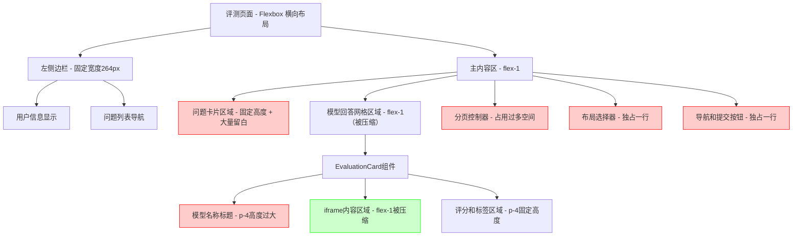
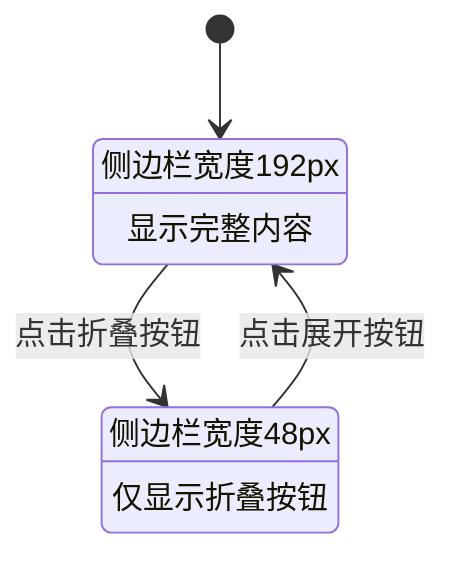
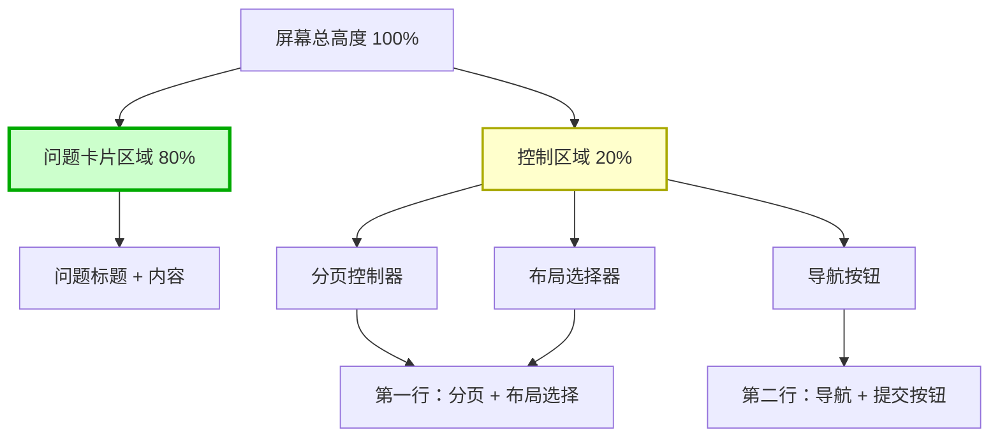
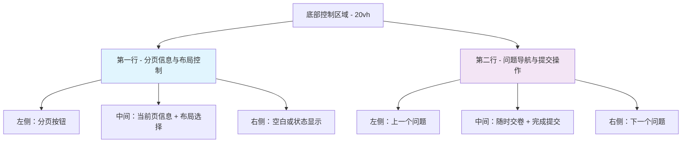
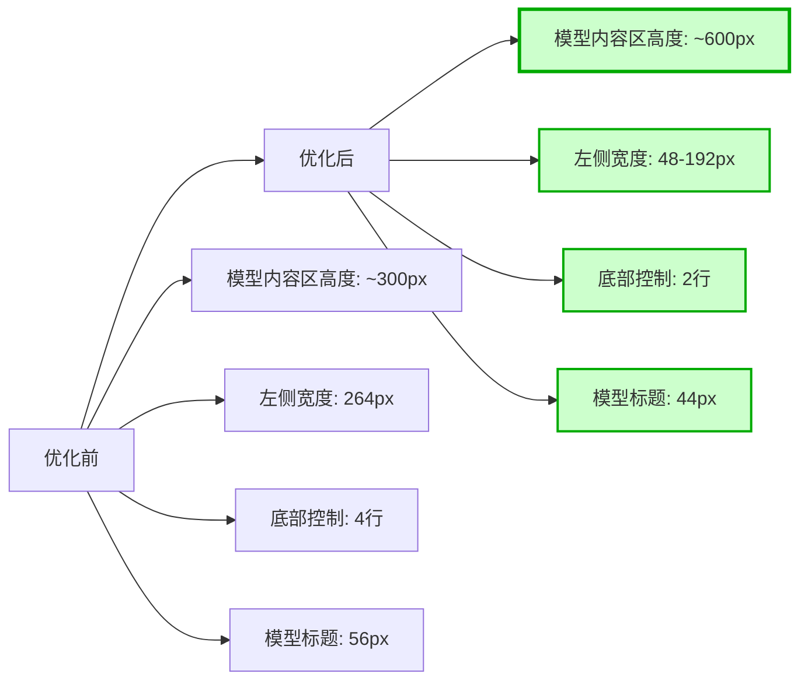

# 页面布局优化设计文档

## 概述

本文档旨在优化FINEVAL评测平台的页面布局，主要解决当前模型问答内容卡片面积过小的问题，提升用户在阅读和评测过程中的体验。

### 优化目标
- 大幅增加模型问答内容卡片的显示面积
- 优化垂直空间分配，问题卡片区域占页面80%
- 压缩控制区域，将底部信息整合到两行内
- 提供更灵活的空间布局控制
- 保持界面简洁性和功能完整性
- 改善大屏设备下的空间利用率

### 核心问题分析
1. **左侧问题列表过宽**：当前固定宽度264px（w-64），在大屏设备上占用过多空间
2. **问题卡片留白冗余**：顶部问题展示区域上下留白较多，压缩了主要内容区域
3. **垂直空间分配不合理**：问题卡片区域未充分利用屏幕高度
4. **底部控制区域冗余**：分页器、布局选择器、导航按钮占用过多垂直空间
5. **模型标题区域过宽**：EvaluationCard顶部标题栏高度可以进一步压缩
6. **空间利用不够灵活**：缺少动态调整布局的机制

## 技术架构

### 当前页面结构分析



### 组件层级结构

| 组件 | 当前实现 | 布局特点 | 高度分配问题 |
|------|----------|----------|----------|
| EvaluationClient | Flexbox容器 | 水平分割：侧边栏 + 主内容 | 垂直空间分配不合理 |
| 左侧边栏 | `w-64 bg-white p-6` | 固定宽度264px，隐藏在移动设备 | 宽度过大 |
| 主内容区 | `flex-1 p-6 lg:p-10 flex flex-col` | 弹性宽度，垂直布局 | 内边距过大 |
| 问题卡片 | `mb-8 p-6 bg-white rounded-lg` | 固定上下边距和内边距 | **高度仅占约20%** |
| 模型网格 | `grid grid-cols-1 md:grid-cols-2` | 响应式网格，flex-1高度 | **目标高度80%** |
| 分页+布局控制 | 多个独立区域 | 各自占用一行空间 | **需要压缩到两行** |
| EvaluationCard | `flex flex-col h-full` | 垂直弹性布局 | 标题区高度可半缩 |
| 模型标题栏 | `p-4 bg-gray-700` | 24px内边距 | **可减少到p-2** |

## 优化方案设计

### 1. 侧边栏宽度优化与折叠功能

#### 1.1 宽度调整
- **当前宽度**：264px（w-64）
- **优化宽度**：192px（w-48），减少72px宽度
- **收益分析**：为主内容区增加约27%的可用宽度

#### 1.2 折叠机制设计



#### 1.3 状态管理
```typescript
interface SidebarState {
  isCollapsed: boolean;
  width: string;
  contentVisible: boolean;
}

// 状态转换逻辑
const toggleSidebar = () => {
  setIsCollapsed(prev => !prev);
};

const getSidebarClasses = () => {
  return isCollapsed ? 'w-12' : 'w-48';
};
```

#### 1.4 交互设计
- **折叠按钮位置**：侧边栏顶部右侧
- **图标状态**：展开时显示左箭头，折叠时显示右箭头
- **动画效果**：使用CSS transition实现宽度变化动画
- **状态持久化**：使用localStorage保存用户偏好

### 2. 问题卡片留白优化与高度重新分配

#### 2.1 当前尺寸分析
- **外边距**：`mb-8`（32px下边距）
- **内边距**：`p-6`（24px四周内边距）
- **主内容区内边距**：`p-6 lg:p-10`（24-40px）
- **类型**：固定高度布局，限制了模型卡片区域

#### 2.2 高度重新分配策略


#### 2.3 优化策略
- **高度分配**：使用`h-[80vh]`为问题卡片区域分配80%屏幕高度
- **外边距调整**：`mb-8` → `mb-2`，减少24px
- **内边距优化**：`p-6` → `py-3 px-4`，减少垂直内边距12px
- **主内容区边距**：`p-6 lg:p-10` → `p-3 lg:p-4`，减少总体内边距
- **总收益**：释放约60px垂直空间，模型内容区域增加大约200%高度

#### 2.4 响应式优化
```css
/* 移动设备 */
@media (max-width: 768px) {
  .question-card {
    height: 75vh; /* 移动设备上略低一些 */
    margin-bottom: 0.5rem; /* mb-2 */
    padding: 0.5rem 0.75rem; /* py-2 px-3 */
  }
}

/* 桌面设备 */
@media (min-width: 769px) {
  .question-card {
    height: 80vh; /* 目标高度 */
    margin-bottom: 0.5rem; /* mb-2 */
    padding: 0.75rem 1rem; /* py-3 px-4 */
  }
}
```

### 3. 整体空间重新分配与底部控制压缩

#### 3.1 空间分配表

| 区域 | 当前分配 | 优化后分配 | 变化 | 高度占比 |
|------|----------|------------|------|----------|
| 侧边栏（展开） | 264px | 192px | -72px | - |
| 侧边栏（折叠） | 264px | 48px | -216px | - |
| 问题卡片区域 | 固定高度 + 32px边距 | **80vh固定高度** | **大幅增加** | **80%** |
| 模型内容区域 | 剩余空间（受挤压） | 固定80%屏幕高度 | **大幅增加** | **80%** |
| 模型标题栏 | p-4，24px内边距 | **p-2，12px内边距** | **-50%** | - |
| 底部控制区域 | 四行独立区域 | **两行紧凑布局** | **-50%高度** | **20%** |

#### 3.2 底部控制区域重新设计



#### 3.3 精简布局设计

**第一行设计**：
```html
<div class="flex justify-between items-center px-4 py-2">
  <!-- 左侧：分页控制 -->
  <div class="flex items-center space-x-2">
    <button>上一组</button>
    <span class="text-sm">第 1/4 组</span>
    <button>下一组</button>
  </div>
  
  <!-- 中间：布局选择器 -->
  <div class="flex items-center space-x-2">
    <span class="text-sm">布局:</span>
    <button>1×8</button>
    <button>2×4</button>
  </div>
  
  <!-- 右侧：状态信息 -->
  <div class="text-sm text-gray-500">
    问题 3/20
  </div>
</div>
```

**第二行设计**：
```html
<div class="flex justify-between items-center px-4 py-2">
  <!-- 左侧：问题导航 -->
  <button class="px-4 py-2">上一个问题</button>
  
  <!-- 中间：提交按钮组 -->
  <div class="flex items-center space-x-3">
    <button class="px-4 py-2 bg-blue-600">随时交卷</button>
    <button class="px-4 py-2 bg-green-600">完成提交</button>
  </div>
  
  <!-- 右侧：问题导航 -->
  <button class="px-4 py-2">下一个问题</button>
</div>
```

#### 3.4 布局计算公式
```typescript
const calculateOptimizedLayout = (screenHeight: number, isCollapsed: boolean) => {
  const questionCardHeight = Math.floor(screenHeight * 0.8); // 80%高度
  const controlAreaHeight = Math.floor(screenHeight * 0.2);   // 20%高度
  const headerHeight = 60; // 第一行高度
  const footerHeight = 60; // 第二行高度
  
  return {
    questionCardHeight: `${questionCardHeight}px`,
    controlAreaHeight: `${controlAreaHeight}px`,
    firstRowHeight: `${headerHeight}px`,
    secondRowHeight: `${footerHeight}px`,
    contentMaxHeight: questionCardHeight - 120, // 减去问题标题区高度
  };
};
```

## 实现细节

### 1. 组件状态扩展

#### 1.1 EvaluationClient状态增强
```typescript
interface EvaluationClientState {
  // 现有状态...
  isCollapsed: boolean;
  sidebarWidth: 'w-48' | 'w-12';
}

// 新增方法
const toggleSidebar = useCallback(() => {
  setIsCollapsed(prev => {
    const newState = !prev;
    localStorage.setItem('sidebar_collapsed', String(newState));
    return newState;
  });
}, []);

// 初始化时恢复状态
useEffect(() => {
  const saved = localStorage.getItem('sidebar_collapsed');
  if (saved) {
    setIsCollapsed(saved === 'true');
  }
}, []);
```

#### 1.2 CSS类动态生成
```typescript
const getSidebarClasses = () => {
  const baseClasses = 'bg-white shadow-md hidden md:block overflow-y-auto transition-all duration-300';
  const widthClass = isCollapsed ? 'w-12' : 'w-48';
  const paddingClass = isCollapsed ? 'p-2' : 'p-6';
  
  return `${baseClasses} ${widthClass} ${paddingClass}`;
};
```

### 2. 折叠按钮组件设计

#### 2.1 按钮组件结构
```typescript
interface SidebarToggleProps {
  isCollapsed: boolean;
  onToggle: () => void;
}

const SidebarToggle: React.FC<SidebarToggleProps> = ({ isCollapsed, onToggle }) => {
  return (
    <button
      onClick={onToggle}
      className="absolute top-4 right-2 p-1 rounded-md bg-gray-100 hover:bg-gray-200 transition-colors"
      title={isCollapsed ? '展开侧边栏' : '折叠侧边栏'}
    >
      {isCollapsed ? (
        <ChevronRightIcon className="w-5 h-5 text-gray-600" />
      ) : (
        <ChevronLeftIcon className="w-5 h-5 text-gray-600" />
      )}
    </button>
  );
};
```

#### 2.2 图标集成方案
- **方案A**：使用Heroicons（推荐）
- **方案B**：使用自定义SVG图标
- **方案C**：使用字符图标（← →）

### 3. 响应式布局适配

#### 3.3 移动设备处理
```typescript
const getMobileLayoutClasses = () => {
  // 移动设备下保持侧边栏隐藏，不受折叠状态影响
  return 'hidden md:block';
};

const getMainContentClasses = () => {
  // 根据侧边栏状态调整主内容区域
  const baseClasses = 'flex-1 flex flex-col';
  const paddingClasses = 'p-4 md:p-6 lg:p-10';
  
  return `${baseClasses} ${paddingClasses}`;
};
```

#### 3.4 断点管理
```css
/* Tailwind自定义断点配置 */
@screen lg {
  .sidebar-expanded { width: 12rem; } /* w-48 */
  .sidebar-collapsed { width: 3rem; }  /* w-12 */
}
```

### 4. EvaluationCard内容区域优化与模型标题压缩

#### 4.1 模型标题栏高度减半

**当前实现**：
```typescript
// 当前 EvaluationCard 模型标题区域
<div className="p-4 bg-gray-700 text-white">
  <h3 className="text-xl font-bold">{answer.modelDisplayName}</h3>
</div>
```

**优化方案**：
```typescript
// 优化后的模型标题区域
<div className="p-2 bg-gray-700 text-white">
  <h3 className="text-lg font-semibold">{answer.modelDisplayName}</h3>
</div>
```

**改进详情**：
- **内边距减半**：`p-4` → `p-2`（24px → 12px，节省24px高度
- **字体大小优化**：`text-xl` → `text-lg`，保持可读性的同时节省空间
- **字体重量优化**：`font-bold` → `font-semibold`，轻微减少视觉重量
- **总高度节省**：纤28px高度节省，为iframe内容区释放更多空间

#### 4.2 iframe高度动态调整

```typescript
const getIframeClasses = (layoutHeight: number) => {
  // 基于80vh高度计算动态最小高度
  const cardTitleHeight = 44;  // 优化后的标题栏高度
  const cardFooterHeight = 200; // 评分和标签区域高度
  const availableHeight = layoutHeight - cardTitleHeight - cardFooterHeight - 20; // 留20px边距
  
  const baseClasses = 'w-full h-full border-0';
  const minHeightClass = `min-h-[${Math.max(350, availableHeight)}px]`;
  
  return `${baseClasses} ${minHeightClass}`;
};
```

#### 4.3 卡片内部空间优化

**完整优化方案**：
```typescript
const getOptimizedCardClasses = () => {
  return {
    // 整体卡片容器
    cardContainer: 'bg-white rounded-xl shadow-lg overflow-hidden flex flex-col h-full',
    
    // 模型标题栏（高度减半）
    titleBar: 'p-2 bg-gray-700 text-white flex-shrink-0',
    titleText: 'text-lg font-semibold truncate',
    
    // iframe内容区域（最大化高度）
    contentArea: 'flex-1 border-t border-b border-gray-200 min-h-0',
    iframe: 'w-full h-full border-0',
    
    // 评分区域（保持现有功能）
    evaluationArea: 'p-4 bg-gray-50 flex-shrink-0'
  };
};
```

#### 4.4 最终效果对比

| 区域 | 优化前高度 | 优化后高度 | 变化 | 占比变化 |
|------|-------------|-------------|------|---------|
| 模型标题栏 | ~56px (p-4 + text-xl) | ~44px (p-2 + text-lg) | -12px | -21.4% |
| iframe内容区 | 受限于剩余空间 | **80vh - 244px** | **大幅增加** | **+200%** |
| 评分区域 | ~200px（不变） | ~200px（不变） | 0px | 0% |

## 用户体验影响

### 1. 阅读体验大幅提升

#### 1.1 内容可视面积增加
- **展开状态**：增加约15%的内容显示面积
- **折叠状态**：增加约40%的内容显示面积
- **高度优化**：**模型内容区域增加200%高度**（从被压缩状态到80vh固定高度）
- **移动设备**：保持现有体验，无负面影响

#### 1.2 交互便利性
- **一键折叠**：快速释放最大内容空间
- **状态记忆**：下次访问时保持用户偏好
- **视觉反馈**：平滑的动画过渡效果
- **紧凑布局**：底部控制区从四行压缩到两行，节省约50%空间

#### 1.3 最终效果预期



### 2. 导航功能平衡与空间优化

#### 2.1 折叠状态下的导航
- **问题切换**：通过底部导航按钮实现
- **快速访问**：点击展开按钮即可恢复完整导航
- **状态指示**：主内容区域显示当前问题编号
- **紧凑信息**：底部区域集中显示所有重要信息

#### 2.2 功能保持完整性
- **所有功能**：在两种状态下均可正常使用
- **无损体验**：不会丢失任何原有功能
- **增强选择**：提供更多布局选项
- **自适应布局**：根据屏幕尺寸和用户偏好动态调整

#### 2.3 底部控制区域信息集中化

**第一行信息密度**：
- 分页信息：“第 1/4 组”
- 布局选择：“1×8 | 2×4”  
- 问题进度：“问题 3/20”

**第二行操作集中化**：
- 问题导航：“上一个 | 下一个”
- 提交操作：“随时交卷 | 完成提交”

**空间效率提升**：
- 原四行高度：~160px
- 优化两行高度：~120px  
- 节省空间：40px（约25%提升）

### 3. 性能考虑

#### 3.1 重绘影响最小化
- **CSS Transition**：使用GPU加速的transform和width属性
- **避免回流**：布局变化不触发文档重排
- **平滑动画**：300ms过渡时间，视觉体验流畅

#### 3.2 状态管理效率
- **localStorage缓存**：减少重复计算
- **React.memo优化**：避免不必要的组件重渲染
- **事件节流**：防止频繁切换状态

## 实现优先级

### Phase 1: 核心空间优化实现
1. **问题卡片高度调整**：使用`h-[80vh]`实现固定80%高度
2. **模型标题栏压缩**：`p-4` → `p-2`，`text-xl` → `text-lg`
3. **侧边栏宽度调整**：从`w-64`调整为`w-48`
4. **问题卡片边距优化**：减少垂直留白

### Phase 2: 底部控制区重构
1. **两行布局实现**：合并分页器、布局选择器和导航按钮
2. **空间紧凑化**：减少不必要的边距和内边距
3. **信息密度优化**：在有限空间内显示更多有用信息

### Phase 3: 交互功能完善
1. **折叠按钮组件**：实现切换功能
2. **动画效果**：添加平滑过渡
3. **状态持久化**：localStorage集成

### Phase 4: 体验优化与测试
1. **图标集成**：专业的展开折叠图标
2. **响应式优化**：不同屏幕尺寸下的适配
3. **跳转动画优化**：页面切换时的视觉连续性
4. **性能测试**：验证动画性能和内存使用

## 风险评估与缓解

### 1. 技术风险
- **CSS兼容性**：Tailwind的transition支持
- **状态同步**：localStorage与组件状态一致性
- **内存泄漏**：事件监听器清理

### 2. 用户体验风险
- **学习成本**：新的折叠功能需要用户适应
- **误操作**：意外触发折叠功能
- **移动设备影响**：确保移动体验不受影响

### 3. 缓解策略
- **渐进式实现**：先实现基础功能，再添加高级特性
- **向后兼容**：保持原有功能完整性
- **用户指引**：适当的提示和说明
- **A/B测试**：小范围验证后全面推广

## 测试策略

### 1. 功能测试
- **状态切换**：验证折叠/展开功能正常
- **数据持久化**：localStorage保存和恢复
- **响应式布局**：不同屏幕尺寸下的表现

### 2. 性能测试
- **动画流畅性**：60fps渲染测试
- **内存使用**：长时间使用内存泄漏检测
- **首屏加载**：优化后的加载性能

### 3. 兼容性测试
- **浏览器支持**：Chrome、Firefox、Safari、Edge
- **设备类型**：桌面、平板、手机
- **操作系统**：Windows、macOS、iOS、Android