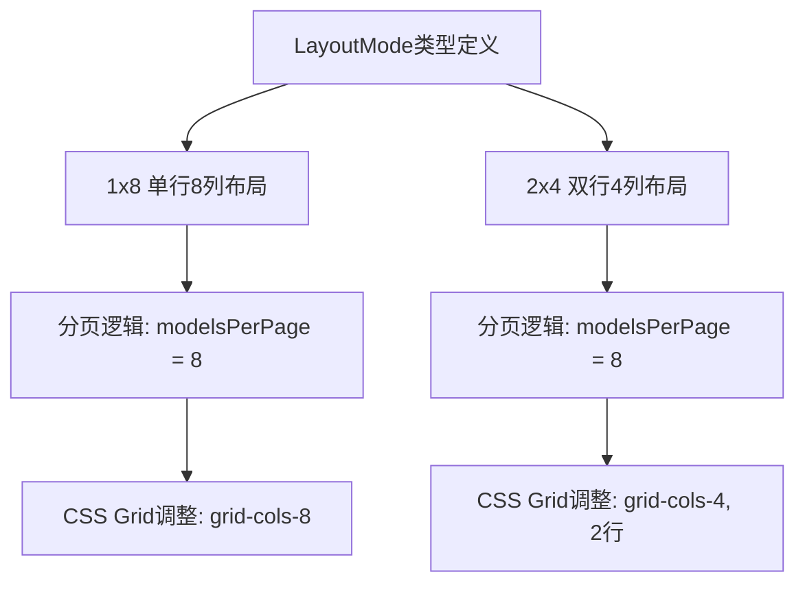
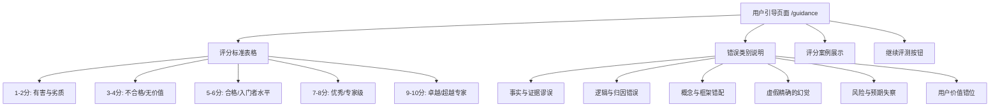
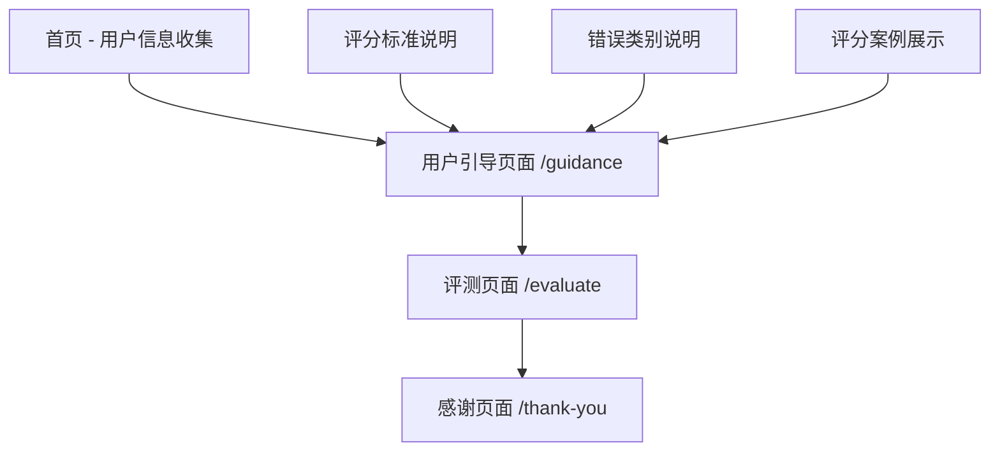

# FINEVAL 网页内容修改设计文档

## 概述

本设计文档详细说明对FINEVAL项目进行的网页内容修改，主要包括页面布局调整、错误分类更新、用户引导页面新增以及用户信息收集字段调整。这些修改旨在优化用户体验，提升评测系统的专业性和易用性。

## 技术架构

项目基于Next.js 15.3.4框架构建，采用React组件化开发模式，使用Tailwind CSS进行样式管理，集成Supabase作为后端服务。

## 核心修改需求

### 1. 页面布局调整

#### 1.1 布局模式修改

将评测页面布局从现有的"1x10"和"2x5"模式调整为"1x8"和"2x4"模式，适配每题8个模型的新配置。

**修改范围：**
- `app/components/EvaluationClient.tsx`
- 布局切换逻辑
- 分页算法
- 响应式设计适配

**实施方案：**



#### 1.2 组件状态更新

**EvaluationClient组件修改：**
- 更新`LayoutMode`类型定义：`'1x8' | '2x4'`
- 修改`getModelsPerPage`函数逻辑
- 调整布局切换按钮文案
- 更新CSS类名和响应式断点

### 2. 评价标签系统重构

#### 2.1 删除优点选项

完全移除评测卡片中的"优点"评价选项，简化用户操作流程。

**修改范围：**
- `app/components/EvaluationCard.tsx`
- `lib/types.ts`中的`EvaluationData`接口
- 数据库架构（如需要）

#### 2.2 缺点分类重新设计

将现有缺点分类替换为6大专业错误类别：

| 错误类别 | 英文标识 | 描述 |
|---------|---------|------|
| 事实与证据谬误 | factual_errors | 数据幻觉、事实硬伤、选择性呈现 |
| 逻辑与归因错误 | logical_errors | 后视镜偏见、指标随意解读、循环论证 |
| 概念与框架错配 | conceptual_errors | 基础概念混淆、过度简化、哲学缝合 |
| 虚假精确的幻觉 | precision_illusion | 武断配置比例、神秘价格点位、僵化判断阈值 |
| 风险与预期失察 | risk_blindness | 报喜不报忧、线性外推、缺乏压力测试 |
| 用户价值错位 | value_misalignment | 不切实际建议、诱导性指令、答非所问 |

### 3. 用户引导页面设计

#### 3.1 评分标准说明页面

创建新的路由页面`/guidance`，向用户展示专业的评分标准和错误分类说明。

**页面结构：**



#### 3.2 评分标准表格设计

**表格结构：**

| 字段 | 内容描述 |
|-----|---------|
| 得分范围 | 1-2分, 3-4分, 5-6分, 7-8分, 9-10分 |
| 水平名称 | 有害与劣质, 不合格/无价值, 合格/入门者水平, 优秀/专家级, 卓越/超越专家 |
| 核心特征描述 | 详细的质量标准说明 |
| 人类水平类比 | 便于理解的对比描述 |
| 回答修改建议 | 针对性的改进指导 |

#### 3.3 错误类别说明表格

展示6大错误类别的典型表现案例，帮助用户准确识别和分类问题。

### 4. 用户信息收集字段调整

#### 4.1 职业领域字段修改

将"职业领域"字段替换为"金融知识学习年限"，提供更精准的用户背景信息。

**选项设计：**
- 无基础（0年）
- 初学者（1-2年）
- 中级（3-5年）
- 高级（5-10年）
- 专家级（10年以上）

#### 4.2 新增用户性别字段

添加性别信息收集，用于用户画像分析。

**选项设计：**
- 男性
- 女性
- 其他
- 不愿透露

### 5. 页面导航流程优化

#### 5.1 新的导航流程



#### 5.2 路由配置更新

**新增路由：**
- `/guidance` - 用户引导页面
- 保持现有路由：`/`, `/evaluate`, `/thank-you`

## 数据模型更新

### EvaluationData接口修改

```typescript
interface EvaluationData {
  score: number;
  // 删除：pros: string[];
  cons: string[]; // 使用新的6大错误类别
}
```

### UserInfo接口修改

```typescript
interface UserInfo {
  name: string;
  // 修改：profession → financialLearningYears
  financialLearningYears: string;
  // 新增：gender
  gender: string;
  experience: string;
}
```

## 组件架构更新

### 新增组件

#### GuidancePage组件
- 路径：`app/guidance/page.tsx`
- 功能：展示评分标准和错误分类说明
- 特性：响应式表格设计，清晰的视觉层次

#### EvaluationStandardsTable组件
- 路径：`app/components/EvaluationStandardsTable.tsx`
- 功能：渲染评分标准表格
- 特性：可折叠详情，移动端适配

#### ErrorCategoriesTable组件
- 路径：`app/components/ErrorCategoriesTable.tsx`
- 功能：展示错误类别说明
- 特性：案例展示，分类标签

### 修改现有组件

#### EvaluationCard组件
- 移除优点评价功能
- 更新缺点选项为6大错误类别
- 优化布局适配1x8和2x4模式

#### EvaluationClient组件
- 更新布局模式逻辑
- 修改分页算法
- 调整状态管理

#### 首页组件（page.tsx）
- 更新用户信息收集表单
- 修改职业字段为金融学习年限
- 新增性别选择字段
- 添加引导页面导航逻辑

## 样式设计规范

### 布局适配方案

#### 1x8布局样式
```css
.layout-1x8 {
  display: grid;
  grid-template-columns: repeat(8, 1fr);
  gap: 1rem;
}

@media (max-width: 1536px) {
  .layout-1x8 {
    grid-template-columns: repeat(4, 1fr);
    grid-template-rows: repeat(2, 1fr);
  }
}
```

#### 2x4布局样式
```css
.layout-2x4 {
  display: grid;
  grid-template-columns: repeat(4, 1fr);
  grid-template-rows: repeat(2, 1fr);
  gap: 1rem;
}

@media (max-width: 768px) {
  .layout-2x4 {
    grid-template-columns: repeat(2, 1fr);
    grid-template-rows: repeat(4, 1fr);
  }
}
```

### 表格样式规范

引导页面中的表格采用清晰的视觉层次设计：
- 表头使用深色背景
- 奇偶行采用不同背景色
- 响应式设计支持移动端水平滚动
- 重要信息高亮显示

## 实施优先级

### 高优先级（核心功能）
1. 页面布局从10模型调整为8模型
2. 删除优点选项功能
3. 更新缺点分类为6大错误类别
4. 修改用户信息收集字段

### 中优先级（用户体验）
1. 创建用户引导页面
2. 实现评分标准展示
3. 添加错误类别说明
4. 优化导航流程

### 低优先级（增强功能）
1. 评分案例展示
2. 移动端优化
3. 无障碍访问支持
4. 性能优化

## 测试策略

### 功能测试
- 布局切换功能验证
- 评价数据完整性检查
- 用户信息收集流程测试
- 导航跳转逻辑验证

### 用户体验测试
- 多设备响应式测试
- 评分标准理解度测试
- 操作流程流畅性验证
- 错误分类准确性评估

### 兼容性测试
- 主流浏览器兼容性
- 移动设备适配测试
- 不同屏幕尺寸验证
- 网络状况适应性测试