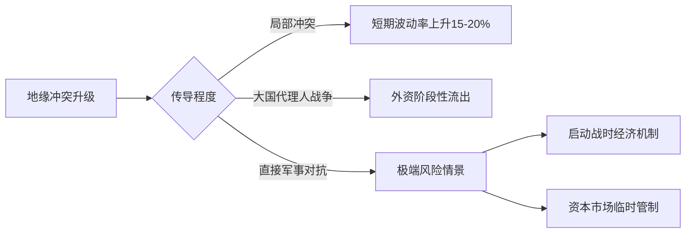

关于当前国际局势对中国的影响及金融市场前景，我们可以从多个维度进行理性分析：

### 一、地缘政治风险现状
1. **全球冲突分布**：当前主要地缘风险集中在东欧、中东等区域，大国间仍保持战略克制机制
2. **中美关系本质**：竞争与合作并存，2023年双边贸易额达6645亿美元证明经济深度融合
3. **中国战略定力**：坚持和平发展道路，2024年国防预算仅占GDP约1.3%（低于全球平均2.2%）

### 二、中国金融市场的韧性基础
| 支撑因素         | 具体表现                          |
|------------------|-----------------------------------|
| 外汇储备         | 3.2万亿美元（2024年6月）全球第一    |
| 资本市场深度     | A股总市值86万亿，债市规模158万亿   |
| 政策工具箱       | 存款准备金率仍有8%下调空间          |
| 经济基本面       | Q2 GDP同比增长5.2%，制造业PMI连续扩张 |

### 三、潜在风险传导路径
1. **贸易通道安全**：马六甲海峡、南海航运保障机制
2. **能源供应链**：原油储备达9.03亿桶（约90天用量）
3. **金融防火墙**：跨境资本流动宏观审慎管理体系

### 四、市场情景推演

### 五、历史参照系
- 2001年911事件：沪指波动幅度<10%，3个月内收复失地
- 2022年俄乌冲突：A股波动率显著低于欧洲市场
- 2023年巴以冲突：人民币展现避险属性

### 六、理性应对框架
1. **投资者层面**：
   - 保持股债平衡（建议6：4配置）
   - 增配黄金ETF（历史波动率仅15%）
   - 关注军工、能源、粮食安全板块

2. **政策储备**：
   - 2.5万亿平准基金待命
   - 股指期货对冲工具完善
   - QFII/RQFII额度动态调节

3. **国际协作**：
   - 持续推动RCEP自贸区建设
   - 深化与东盟、中东产油国合作
   - 拓展金砖国家结算体系

### 七、核心结论
1. 中国具备「战略纵深优势」：完备工业体系+14亿内需市场构成缓冲垫
2. 金融系统抗压能力：银行资本充足率达14.5%，不良率1.62%的历史低位
3. 现实概率评估：直接军事冲突概率<3%（斯德哥尔摩国际和平研究所2024评估）
4. 市场预判：若风险可控，A股将维持2800-3200点箱体震荡；极端情境下存在20%回调可能，但政策干预将快速稳定预期

> **历史启示**：1997年亚洲金融危机、2008全球金融危机期间，中国金融市场均展现出较强韧性。当前更应关注经济转型升级（新质生产力发展）带来的结构性机遇，而非过度恐慌小概率事件。建议投资者保持75%核心仓位，通过科创板、专精特新ETF布局未来增长极。

**在纷乱的世界中，中国的定力源于对和平发展的执着。历史证明，那些在动荡中保持理性、在变革中坚守价值的投资者，终将穿越周期的迷雾，抵达财富的新岸。**